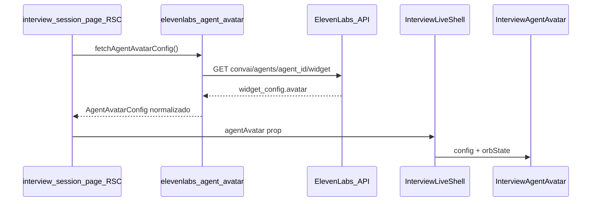

# Integrar avatar del agente ElevenLabs

## Contexto actual

- La entrevista en vivo usa [`@elevenlabs/react`](frontend/package.json) (`ConversationProvider` + `useConversation`) en [`interview-live-client.tsx`](frontend/src/components/interview/interview-live-client.tsx).
- El token del agente ya se obtiene en servidor en [`frontend/src/app/api/elevenlabs/token/route.ts`](frontend/src/app/api/elevenlabs/token/route.ts) con `ELEVENLABS_AGENT_ID`.
- La UI muestra un orbe genérico en [`interview-orb.tsx`](frontend/src/components/interview/interview-orb.tsx), montado desde [`interview-live-shell.tsx`](frontend/src/components/interview/interview-live-shell.tsx).
- No hay componente `Avatar` de shadcn instalado; no hace falta añadirlo si usamos `` circular o el orbe existente.

## Enfoque elegido (sincronización ElevenLabs)

ElevenLabs expone la configuración visual del agente vía **GET** `https://api.elevenlabs.io/v1/convai/agents/{agent_id}/widget`. En `widget_config.avatar` puede venir:

| `type` | Uso en UI |
|--------|-----------|
| `orb` | Orbe animado con `color_1` / `color_2` (equivalente al widget) |
| `image` | Imagen circular con `url` |
| `url` | Imagen externa con `custom_url` |

Referencia: [Widget get](https://elevenlabs.io/docs/eleven-agents/api-reference/widget/get).



## Cambios propuestos

### 1. Capa servidor: obtener y normalizar avatar

Crear [`frontend/src/lib/interview/elevenlabs-agent-avatar.ts`](frontend/src/lib/interview/elevenlabs-agent-avatar.ts):

- Función `fetchAgentAvatarConfig()` (envuelta en `cache()` de React para deduplicar en la misma petición).
- Lee `ELEVENLABS_API_KEY` y `ELEVENLABS_AGENT_ID` (mismas vars que el token).
- Llama a GET `/v1/convai/agents/{agentId}/widget`.
- Devuelve un tipo discriminado, por ejemplo:

```ts
export type AgentAvatarConfig =
  | { kind: "orb"; color1: string; color2: string }
  | { kind: "image"; url: string }
  | { kind: "default" }; // fallback si falta config o error HTTP
```

- Loguear error en servidor y devolver `{ kind: "default" }` sin romper la página (alineado con degradación en [`project-flow.md`](project-flow.md)).

### 2. Pasar config desde la página (sin exponer API key al cliente)

En [`frontend/src/app/interview/[sessionId]/page.tsx`](frontend/src/app/interview/[sessionId]/page.tsx):

- Tras `requireAuth`, `await fetchAgentAvatarConfig()`.
- Pasar `agentAvatar` como prop a `InterviewLiveClient`.

Propagar la prop por la cadena: `InterviewLiveClient` → `InterviewLiveInner` → `InterviewLiveShell`.

### 3. Componente visual unificado

Crear [`frontend/src/components/interview/interview-agent-avatar.tsx`](frontend/src/components/interview/interview-agent-avatar.tsx):

- Props: `config: AgentAvatarConfig`, `state: OrbState`, `className?`.
- **`kind: "default"`** o **`kind: "orb"`**: reutilizar [`InterviewOrb`](frontend/src/components/interview/interview-orb.tsx), extendido para aceptar colores opcionales (`color1`, `color2`) vía variables CSS inline (`--orb-c1`, `--orb-c2`) en el contenedor.
- **`kind: "image"`**: círculo con ``, mismo tamaño que el orbe (~`size-56` / `sm:size-72`), con anillos/pulse en `speaking`/`listening` (reutilizar clases `orb-ripple` o utilidades Tailwind) para no perder feedback de fase.
- `aria-hidden` solo en decoración; la imagen lleva `alt` accesible.

Ajuste mínimo en [`interview-orb.tsx`](frontend/src/components/interview/interview-orb.tsx) y [`globals.css`](frontend/src/app/globals.css): gradientes del core/halo que lean `var(--orb-c1, …)` y `var(--orb-c2, …)` con los valores actuales como fallback.

### 4. Integrar en el shell

En [`interview-live-shell.tsx`](frontend/src/components/interview/interview-live-shell.tsx):

- Sustituir `<InterviewOrb state={orbState} />` por `<InterviewAgentAvatar config={agentAvatar} state={orbState} />`.
- Actualizar copy en [`interview-controls.tsx`](frontend/src/components/interview/interview-controls.tsx) si sigue diciendo solo “orbe” (opcional, una línea).

### 5. Imágenes remotas

Si la URL del avatar viene de dominios ElevenLabs/CDN, usar `` nativo (evita tocar [`next.config.ts`](frontend/next.config.ts) sin conocer el hostname exacto). Si más adelante se estabiliza el host, se puede migrar a `next/image` con `remotePatterns`.

### 6. Configuración en ElevenLabs (manual, fuera del código)

En el dashboard del agente (`ELEVENLABS_AGENT_ID`):

- **Widget → Avatar**: subir imagen (POST `/v1/convai/agents/{id}/avatar`) o elegir orbe con colores.
- Tras cambiar el avatar en ElevenLabs, recargar la página en vivo para ver el cambio (fetch en RSC por request).

No se añaden variables nuevas a [`.env.example`](frontend/.env.example).

## Verificación manual

1. Agente con avatar **tipo imagen** en ElevenLabs → en `/interview/[sessionId]` se ve la foto circular y reacciona al hablar/escuchar.
2. Agente con avatar **tipo orbe** y colores custom → gradiente distinto al default de Nervio.
3. API key inválida o widget sin avatar → orbe actual (comportamiento actual).
4. Flujo de micrófono + conversación sin regresiones (`useInterviewConversation` sin cambios de lógica).

## Alcance explícitamente fuera

- Video avatar / WebRTC (contradice MVP en [`frontend/docs/INTERVIEW-FLOW.md`](frontend/docs/INTERVIEW-FLOW.md) y constitución backend).
- Sustituir la UI custom por el widget embebido `<elevenlabs-convai>` (rompería el layout fullscreen actual).
- Subida de avatar desde la app (solo lectura de la config del agente).
