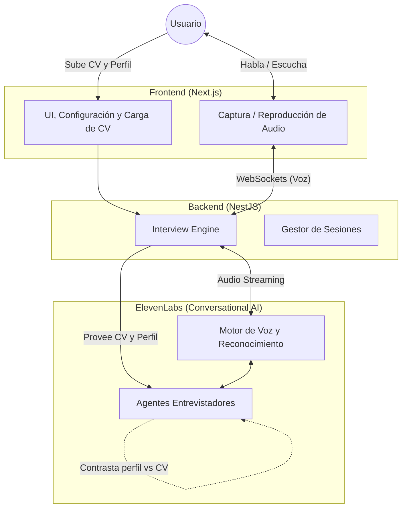
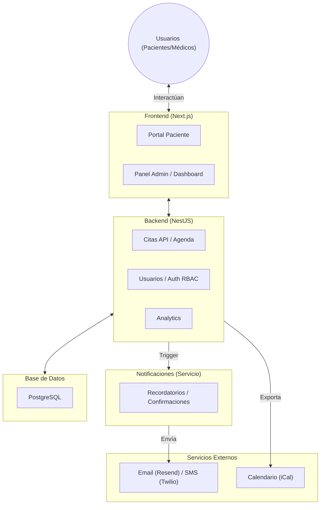

# Actividad Evaluada N°1

**Asignatura:** Aplicación de Técnicas de Ingeniería de Software  
**Docente:** Ing. Silvia Janeth Rico de Serrano  
**Grupo:** 01  
**Día y hora:** Martes y Jueves 08:10 am – 09:50 am  
**Fecha de entrega:** Lunes 27 de julio de 2026

---

## Miembros del Equipo

| N° | Apellidos | Nombres | Carnet |
|----|-----------|---------|--------|
| 1  |           |         |        |
| 2  |           |         |        |
| 3  |           |         |        |
| 4  |           |         |        |
| 5  |           |         |        |

---

---

# Proyecto 1: Nervio — Simulador de Entrevistas Laborales con Inteligencia Artificial y Voz

---

## 1. Identificación del Problema

### 1.1 Contexto y situación actual

En el entorno profesional contemporáneo, la entrevista de trabajo constituye el filtro más determinante dentro de los procesos de selección. A pesar de contar con la formación académica o técnica requerida, una proporción significativa de candidatos —especialmente estudiantes recién egresados y profesionales en etapas iniciales (junior)— experimenta un alto grado de ansiedad y dificultad para articular sus competencias de manera efectiva. Esta incapacidad para demostrar su verdadero potencial suele originarse en la falta de exposición a escenarios de entrevista realistas y desafiantes.

Los métodos convencionales de preparación presentan deficiencias estructurales que limitan el desarrollo de habilidades interpersonales y comunicativas fundamentales:

- **Dependencia de recursos humanos limitados:** La práctica efectiva suele requerir la asistencia de mentores o profesionales experimentados, cuya disponibilidad es escasa, lo que genera un obstáculo logístico constante para el candidato.
- **Carencia de herramientas dinámicas:** Las soluciones actuales se limitan predominantemente a listas de preguntas o simuladores de texto que no replican la naturaleza espontánea, impredecible y bidireccional de una conversación hablada.
- **Ausencia de retroalimentación objetiva y multidimensional:** Las simulaciones informales rara vez proveen un análisis estructurado que evalúe simultáneamente la claridad comunicativa, la asertividad, la estructura lógica y la precisión técnica de las respuestas.
- **Falta de exposición a entornos de alta presión:** Los candidatos casi nunca tienen la oportunidad de practicar en escenarios que induzcan estrés —simulando interrupciones o cuestionamientos incisivos—, lo cual es vital para desarrollar resiliencia profesional.
- **Inexistencia de métricas evolutivas:** Al carecer de un registro histórico y de un sistema de seguimiento, resulta sumamente complejo identificar patrones de mejora o deficiencias conductuales recurrentes a lo largo del tiempo.

### 1.2 Definición del problema

**Los estudiantes y profesionales en búsqueda activa de empleo carecen de una plataforma accesible e inmersiva que simule fielmente las dinámicas de una entrevista laboral real. La ausencia de una herramienta que integre interacción conversacional por voz, personalización adaptativa del nivel de estrés y retroalimentación analítica detallada, ocasiona que los candidatos enfrenten los procesos de selección con preparación deficiente, altos niveles de incertidumbre y sin directrices claras para perfeccionar su desempeño.**

### 1.3 Población afectada

La problemática impacta directamente a diversos segmentos del mercado laboral, destacando:

- **Estudiantes universitarios y recién egresados:** Quienes carecen de experiencia previa en procesos de contratación corporativa y requieren afianzar sus habilidades de comunicación profesional.
- **Profesionales de nivel junior y mid-level (con énfasis en áreas tecnológicas):** Que buscan transicionar hacia roles de mayor responsabilidad y necesitan articular sus perfiles técnicos en conjunto con sus habilidades blandas.
- **Candidatos en búsqueda activa de empleo:** Profesionales de múltiples disciplinas que requieren optimizar sus procesos de postulación para reducir su tiempo de inserción o reinserción laboral.

### 1.4 Consecuencias de no resolver el problema

La perpetuación de estas deficiencias en la preparación para entrevistas conlleva repercusiones tanto a nivel individual como sistémico:

- **Exclusión de talento cualificado:** Candidatos con sólidas habilidades técnicas y potencial son descartados tempranamente debido a fallas en la comunicación de sus competencias.
- **Prolongación de la desocupación:** Se incrementa el tiempo invertido en los ciclos de búsqueda de empleo, generando desgaste emocional, ansiedad y un deterioro de la confianza en los postulantes.
- **Ineficiencia sistémica en el reclutamiento:** Las organizaciones enfrentan un "falso negativo" al evaluar candidatos que, bajo el estrés de una entrevista para la cual no están preparados, ocultan su verdadera capacidad operativa.

---

## 2. Objetivos

### 2.1 Objetivo General

Desarrollar un sistema de simulación de entrevistas laborales impulsado por inteligencia artificial conversacional, capaz de replicar la dinámica de una entrevista real mediante interacción por voz, para proporcionar a los usuarios un entorno de práctica adaptativo que evalúe su desempeño y brinde retroalimentación estructurada sobre sus competencias comunicativas y técnicas.

### 2.2 Objetivos Específicos

1. **Implementar un motor conversacional bidireccional por voz** que gestione la simulación de entrevistas en tiempo real, permitiendo una interacción natural y fluida entre el usuario y el entrevistador virtual.
2. **Personalizar las simulaciones de entrevista** mediante el procesamiento del Curriculum Vitae del candidato y la descripción del puesto deseado, formulando dinámicamente preguntas que contrasten las habilidades declaradas con los requerimientos específicos del rol.
3. **Configurar múltiples perfiles de entrevistador virtual** (Recursos Humanos, Técnico, No Técnico y Agresivo) con comportamientos, tonos de voz y estilos de indagación diferenciados, para exponer al usuario a diversas metodologías de evaluación.
4. **Integrar un módulo de presión adaptativa (modo estrés)** capaz de reaccionar ante señales de inseguridad o vacilación en el candidato, incrementando gradualmente la intensidad de los cuestionamientos para entrenar su resiliencia bajo presión.
5. **Generar un sistema de evaluación y retroalimentación analítica** que cuantifique el desempeño del usuario a través de métricas estandarizadas (claridad, conocimiento, confianza y estructura lógica), identificando fortalezas, debilidades y planes de acción concretos.
6. **Proporcionar herramientas de seguimiento y monitoreo de progreso** que almacenen el historial de evaluaciones del candidato, facilitando la identificación de tendencias de mejora y la consolidación de su preparación a lo largo del tiempo.
7. **Diseñar una interfaz gráfica intuitiva e interactiva** que centralice la gestión del perfil del usuario, la configuración de los parámetros de cada simulación y la visualización detallada de los reportes pos-entrevista.

---

## 3. Misión y Visión

### 3.1 Misión

Potenciar el desempeño de estudiantes y profesionales en procesos de selección mediante simulaciones de entrevistas realistas, dinámicas y accesibles. A través de inteligencia artificial conversacional por voz y retroalimentación estructurada, buscamos reducir la ansiedad de los candidatos y dotarlos de las herramientas necesarias para enfrentar con éxito el mercado laboral.

### 3.2 Visión

Consolidarnos como la plataforma de preparación para entrevistas de referencia en Latinoamérica, destacada por su hiperrealismo e innovación tecnológica. Aspiramos a transformar la inserción profesional siendo el aliado estratégico del talento, evolucionando desde la simulación por voz hacia un ecosistema integral de análisis conductual y conexión inteligente con oportunidades de empleo.

---

## 4. Frontera del Sistema

### 4.1 Diagrama de contexto

#### Descripción del Flujo y Actores Externos
El diagrama ilustra la arquitectura de interacción de Nervio y su relación con entidades fuera de la frontera del sistema. El flujo operativo se define por la participación de los siguientes actores externos:

- **Usuario (Candidato):** Actor principal del sistema. Interactúa con el *Frontend* proporcionando como **entradas** su Curriculum Vitae y los parámetros del rol deseado. Durante la simulación, envía **entradas** de audio continuo (su voz) y recibe como **salidas** tanto el audio generado por el entrevistador virtual como las métricas finales de su evaluación en la interfaz gráfica.
- **ElevenLabs (IA Conversacional):** Servicio cognitivo externo que centraliza el procesamiento inteligente. Recibe como **entradas** el contexto del usuario (CV y perfil), instrucciones del agente y el flujo de audio. Procesa esta información ejecutando reconocimiento de voz (STT), formulación dinámica de preguntas y retorna como **salida** el audio sintetizado (TTS) hacia el Backend, manteniendo la latencia al mínimo.
- **Supabase (Base de Datos como Servicio):** Capa de persistencia externa. Recibe como **entradas** los registros de las sesiones finalizadas y los puntajes de evaluación procesados por el *Backend*. Proporciona como **salidas** los datos históricos necesarios para que el usuario visualice su progreso.
- **Administrador del Sistema:** Actor técnico responsable del mantenimiento y viabilidad de la plataforma. Proporciona como **entradas** configuraciones de sistema y monitorea las **salidas** relacionadas con el estado de los servicios (logs, cuotas de API de ElevenLabs y rendimiento del servidor) para garantizar la estabilidad del MVP.

### 4.2 Lo que el sistema INCLUYE (dentro de la frontera)

| Componente | Funcionalidad incluida |
|------------|----------------------|
| **Configuración y Personalización** | Carga del CV del usuario y selección del rol a aplicar para personalizar la entrevista |
| **Simulación en tiempo real** | Ciclo conversacional completo por voz gestionado por agentes autónomos de ElevenLabs |
| **Motor de IA y Voz** | Integración y orquestación de Agentes, Text-to-Speech (TTS) y Speech-to-Text (STT) centralizados en ElevenLabs |
| **Perfiles de entrevistador** | HR, Técnico, No técnico y Agresivo configurados paramétricamente en los agentes |
| **Modo estrés** | Detección de señales de inseguridad (mediante el análisis de la IA) y escalamiento gradual de presión |
| **Evaluación** | Cálculo de scores por categoría (claridad, conocimiento, confianza, estructura), con fortalezas y debilidades |

### 4.3 Lo que el sistema NO INCLUYE (fuera de la frontera)

| Elemento excluido | Justificación |
|-------------------|---------------|
| **Agendamiento de entrevistas** | Funcionalidad aplazada para no incrementar la complejidad del MVP actual |
| **Automatización con N8N** | Los procesos se manejarán de forma síncrona o interna; integraciones complejas no están contempladas aún |
| **Reproducción de sesiones** | Guardar audios largos y reproducirlos posteriormente queda fuera del alcance actual por costos de almacenamiento |
| **Autenticación avanzada** | En el MVP se usan endpoints públicos temporales; sistemas robustos (ej. Better Auth) se habilitarán en fases posteriores |
| **Matching con ofertas de empleo reales** | Implica integración con bolsas de trabajo y scraping; excede el alcance del simulador |
| **Análisis de video / lenguaje corporal** | Requiere visión por computadora y modelos multimodales, incrementando la latencia innecesariamente |
| **Multilenguaje avanzado** | El MVP opera exclusivamente en español para garantizar la precisión de los agentes |

### 4.4 Interacciones en la frontera

| Entidad externa | Interacción con el sistema | Dirección |
|----------------|---------------------------|-----------|
| **Usuario** | Sube CV, configura perfil, transmite audio en tiempo real y revisa evaluaciones | Entrada / Salida |
| **ElevenLabs** | Aloja los agentes, ingiere contexto, genera comportamiento adaptativo y procesa STT/TTS | Entrada / Salida |
| **Supabase** | Almacena y recupera datos estructurados (sesiones, evaluaciones e historial de métricas) | Entrada / Salida |
| **Administrador del Sistema** | Monitorea logs, gestiona cuotas de API y mantiene la configuración técnica del backend | Entrada / Salida |

---

---

# Proyecto 2: MediAgenda — Sistema de Gestión de Citas Médicas con Notificaciones Inteligentes

---

## 1. Identificación del Problema

### 1.1 Contexto y situación actual

En El Salvador y en gran parte de Latinoamérica, la gestión de citas médicas en clínicas pequeñas y medianas sigue dependiendo de procesos manuales o semimanuales: llamadas telefónicas, cuadernos de registro, hojas de Excel compartidas o, en el mejor de los casos, sistemas heredados de difícil mantenimiento. Esta situación genera múltiples ineficiencias tanto para pacientes como para el personal administrativo y los médicos.

Los problemas más recurrentes son:

- **Altas tasas de inasistencia (no-shows):** Los pacientes olvidan sus citas porque no reciben recordatorios oportunos. Estudios del sector salud estiman que entre el 15% y el 30% de las citas programadas resultan en ausencia, generando pérdida económica y desaprovechamiento de espacios que otros pacientes necesitan.
- **Conflictos de agenda y doble reservación:** Sin un sistema centralizado de disponibilidad en tiempo real, es frecuente que se asignen dos pacientes al mismo horario, generando esperas prolongadas, frustración y pérdida de confianza.
- **Procesos administrativos ineficientes:** El personal de recepción dedica gran parte de su jornada a gestionar citas por teléfono, confirmar asistencia manualmente y reorganizar la agenda ante cancelaciones, en lugar de atender al paciente presencial.
- **Falta de historial organizado:** Sin un sistema digital, el historial de citas anteriores, cancelaciones y patrones de asistencia del paciente se pierde o es difícil de consultar, impidiendo una gestión proactiva.
- **Nula comunicación automatizada:** La mayoría de clínicas no cuenta con un sistema que envíe recordatorios automáticos, confirmaciones ni post-consultas, dependiendo enteramente de la memoria del paciente o de llamadas manuales.

### 1.2 Definición del problema

**Las clínicas médicas pequeñas y medianas carecen de un sistema digital accesible y económico para gestionar citas de manera eficiente, lo que provoca altas tasas de inasistencia, conflictos de agenda, carga administrativa excesiva y una experiencia deficiente para el paciente, impactando directamente la operatividad y los ingresos del establecimiento.**

### 1.3 Población afectada

- Clínicas médicas pequeñas y medianas (1 a 10 médicos).
- Personal administrativo y de recepción de establecimientos de salud.
- Médicos generales y especialistas con consulta privada.
- Pacientes que buscan agendar, confirmar o cancelar citas de forma ágil.

### 1.4 Consecuencias de no resolver el problema

- Pérdida económica significativa por espacios no utilizados debido a inasistencias.
- Mala experiencia del paciente que deteriora la reputación de la clínica.
- Sobrecarga del personal administrativo en tareas repetitivas.
- Imposibilidad de escalar la operación de la clínica de forma ordenada.
- Falta de datos para la toma de decisiones (patrones de demanda, horarios pico, especialidades más solicitadas).

---

## 2. Objetivos

### 2.1 Objetivo General

Desarrollar un sistema web de gestión de citas médicas que automatice el proceso de agendamiento, confirmación y seguimiento de citas para clínicas pequeñas y medianas, reduciendo la tasa de inasistencias mediante notificaciones inteligentes y proporcionando herramientas de gestión de agenda eficientes tanto para el personal administrativo como para los pacientes.

### 2.2 Objetivos Específicos

1. **Implementar un módulo de agendamiento en línea** que permita a los pacientes consultar disponibilidad en tiempo real y reservar citas desde cualquier dispositivo con navegador web, eliminando la necesidad de llamadas telefónicas.

2. **Desarrollar un panel de gestión de agenda** para el personal administrativo y los médicos que muestre la programación diaria, semanal y mensual, con capacidad de bloquear horarios, gestionar cancelaciones y reasignar citas.

3. **Diseñar un sistema de notificaciones inteligentes** que envíe recordatorios automatizados por correo electrónico y/o SMS en intervalos configurables (48h, 24h, 2h antes de la cita) y solicite confirmación de asistencia al paciente.

4. **Construir un módulo de gestión de pacientes** que almacene información de contacto, historial de citas, patrones de asistencia y notas relevantes, facilitando una atención personalizada.

5. **Implementar un sistema de gestión de médicos y especialidades** que permita configurar horarios de atención, duración de consulta por tipo y disponibilidad por día, garantizando una distribución eficiente de la agenda.

6. **Desarrollar un dashboard analítico** que presente métricas clave (tasa de asistencia, cancelaciones, horarios pico, ocupación por médico) para apoyar la toma de decisiones operativas de la clínica.

7. **Garantizar la seguridad y privacidad de los datos** del paciente mediante autenticación robusta, control de acceso basado en roles (administrador, médico, recepcionista, paciente) y cumplimiento de buenas prácticas de manejo de información sensible de salud.

8. **Diseñar la aplicación con una arquitectura modular y escalable** que permita agregar funcionalidades futuras como telemedicina, expediente clínico electrónico o integración con sistemas de facturación.

---

## 3. Misión y Visión

### 3.1 Misión

Simplificar y digitalizar la gestión de citas médicas para clínicas pequeñas y medianas, ofreciendo una plataforma web intuitiva, accesible y económica que automatice la comunicación con los pacientes, optimice la ocupación de la agenda médica y libere al personal administrativo de tareas repetitivas, contribuyendo a una mejor experiencia de salud tanto para el profesional como para el paciente.

### 3.2 Visión

Ser la solución de gestión de citas médicas más adoptada por clínicas pequeñas y medianas en El Salvador y Centroamérica, reconocida por su facilidad de uso, sus notificaciones inteligentes que reducen drásticamente las inasistencias y su capacidad de evolucionar hacia un ecosistema integral de gestión clínica digital.

---

## 4. Frontera del Sistema

### 4.1 Diagrama de contexto

### 4.2 Lo que el sistema INCLUYE (dentro de la frontera)

| Componente | Funcionalidad incluida |
|------------|----------------------|
| **Agendamiento en línea** | Consulta de disponibilidad en tiempo real, reservación, modificación y cancelación de citas por parte del paciente |
| **Gestión de agenda médica** | Vista diaria/semanal/mensual, bloqueo de horarios, configuración de duración por tipo de consulta |
| **Notificaciones automatizadas** | Recordatorios por email/SMS configurables, solicitud de confirmación, notificación de cancelación |
| **Gestión de pacientes** | Registro, historial de citas, patrones de asistencia, información de contacto |
| **Gestión de médicos** | Perfiles, especialidades, horarios de atención, disponibilidad |
| **Dashboard analítico** | Tasa de asistencia, cancelaciones, horarios pico, ocupación por médico |
| **Autenticación y roles** | Login seguro con roles diferenciados (administrador, médico, recepcionista, paciente) |
| **Lista de espera** | Cuando un horario está lleno, el paciente puede anotarse en lista de espera y ser notificado ante cancelaciones |

### 4.3 Lo que el sistema NO INCLUYE (fuera de la frontera)

| Elemento excluido | Justificación |
|-------------------|---------------|
| **Expediente clínico electrónico** | Requiere cumplimiento regulatorio específico y modelado médico complejo; se planifica como módulo futuro |
| **Telemedicina / videollamadas** | Implica infraestructura de streaming y regulación adicional; fuera del alcance del MVP |
| **Facturación y cobros** | Requiere integración con sistemas contables y fiscales; planificado para fases posteriores |
| **Recetas electrónicas** | Regulación farmacéutica y firma digital; fuera del MVP |
| **Aplicación móvil nativa** | El MVP es web responsiva; apps nativas se considerarán según adopción |
| **Integración con seguros médicos** | Complejidad de integración con aseguradoras; fuera del alcance actual |
| **Sistema de pagos en línea** | Requiere pasarelas de pago y manejo de datos financieros; fase futura |

### 4.4 Interacciones en la frontera

| Entidad externa | Interacción con el sistema | Dirección |
|----------------|---------------------------|-----------|
| **Paciente** | Agenda, confirma, cancela y consulta citas; recibe recordatorios | Entrada / Salida |
| **Médico** | Consulta su agenda, bloquea horarios, visualiza historial del paciente | Entrada / Salida |
| **Administrador** | Configura el sistema, gestiona usuarios, consulta métricas | Entrada / Salida |
| **Recepcionista** | Gestiona citas presenciales, registra pacientes, reasigna horarios | Entrada / Salida |
| **Servidor de email** | Recibe solicitudes de envío de recordatorios, confirmaciones y notificaciones | Salida |
| **Proveedor SMS (Twilio)** | Recibe solicitudes de envío de SMS de recordatorio y confirmación | Salida |
| **Calendario externo (iCal)** | Exporta citas en formato iCalendar para sincronización con Google Calendar, Outlook, etc. | Salida |
| **Base de datos (PostgreSQL)** | Almacena y recupera toda la información del sistema | Entrada / Salida |
