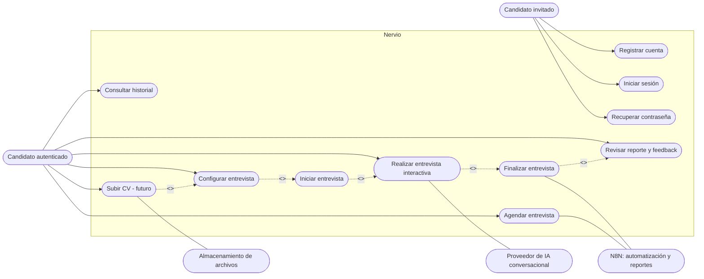
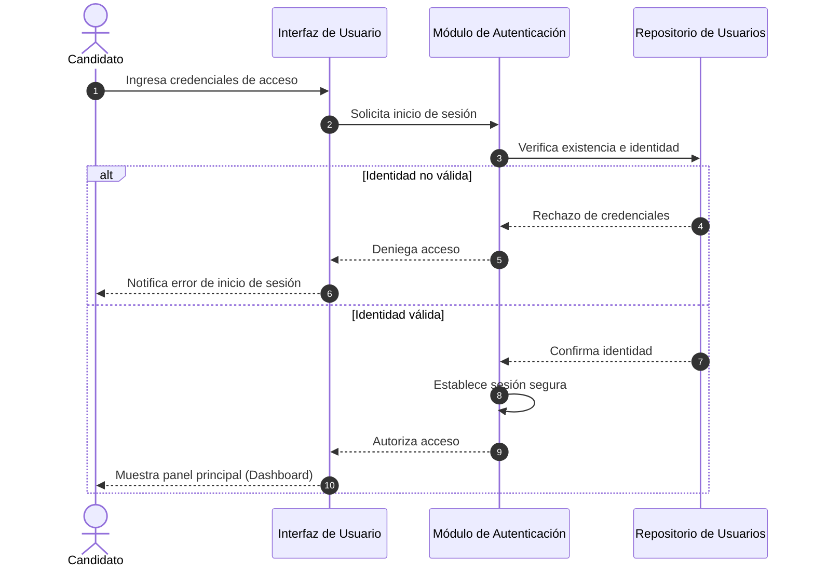
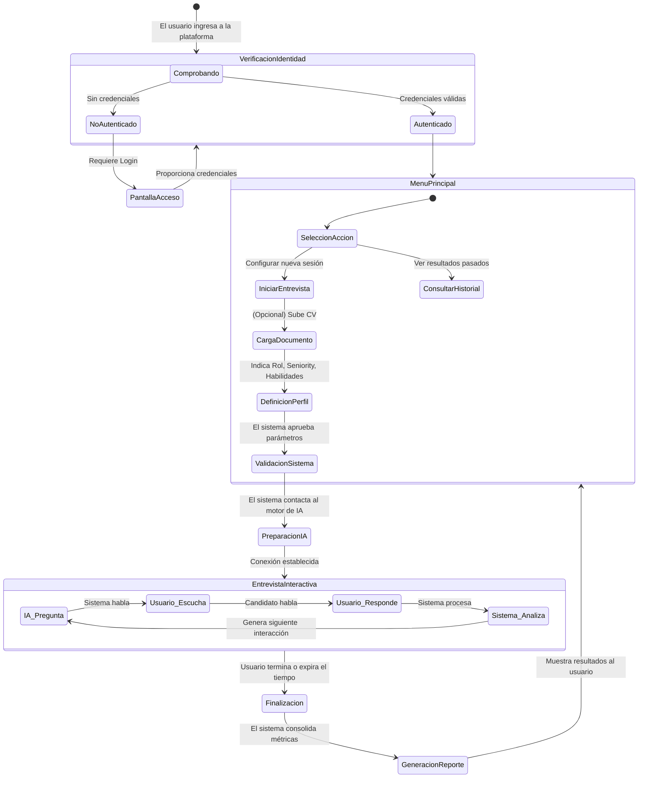
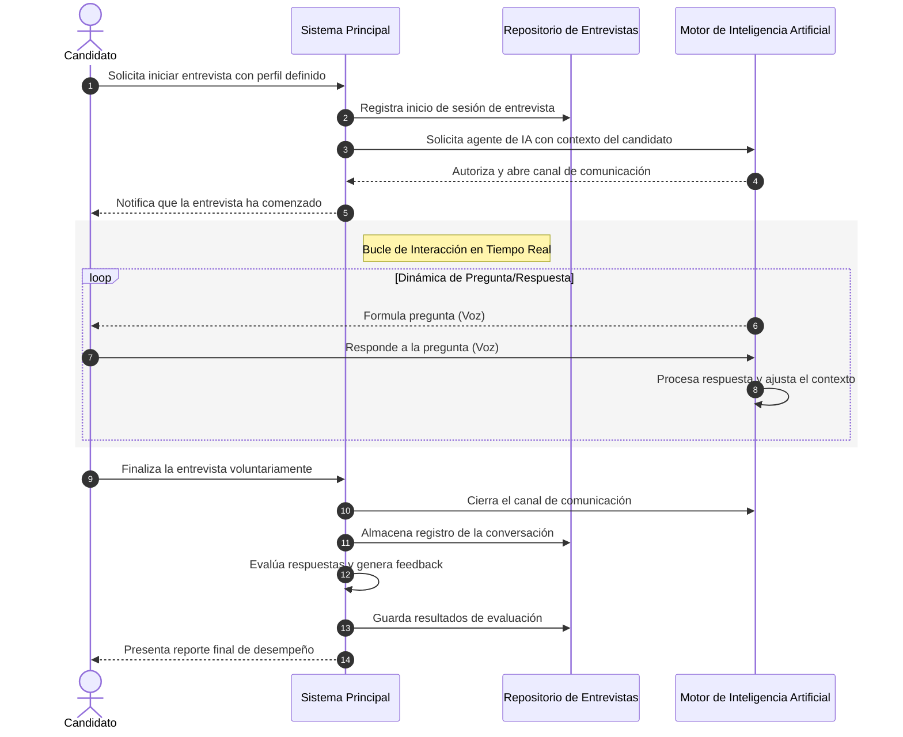
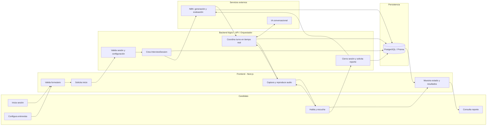
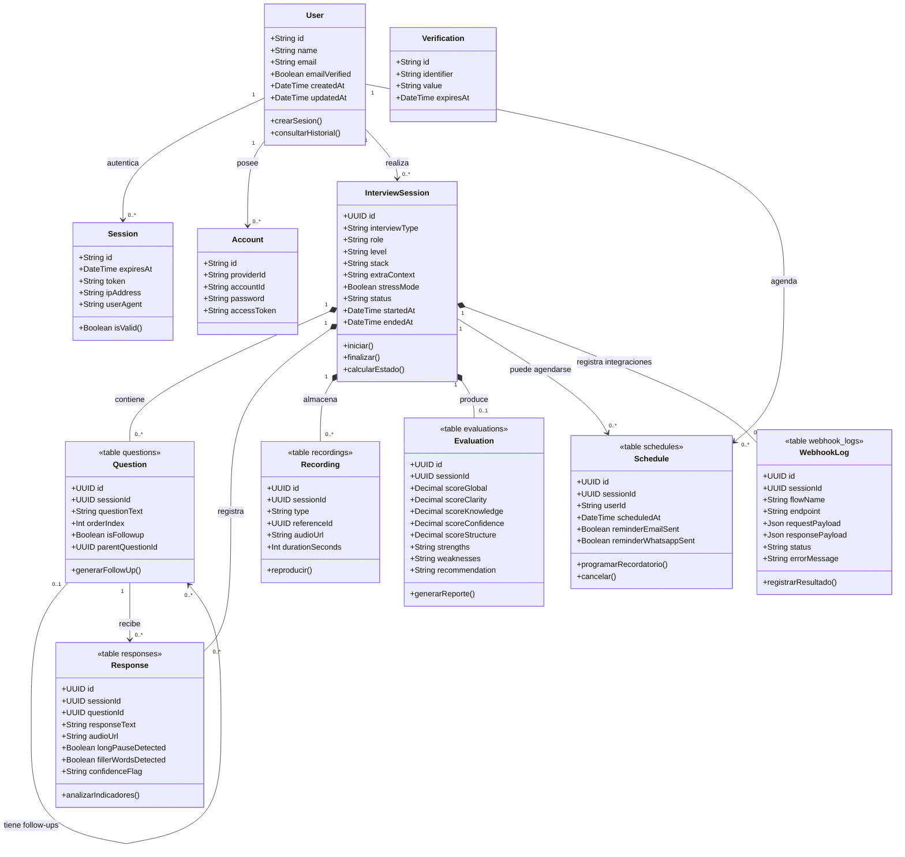
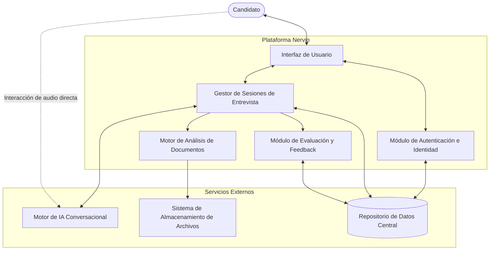

# Especificación Técnica y Análisis de Requerimientos para MVP de Plataforma de Entrevistas

## 1. Objetivo

Desarrollar un documento de especificación técnica y análisis de requerimientos para **Nervio**, una plataforma de entrevistas de trabajo orientada a candidatos. El sistema permitirá a los usuarios:
- **Registrarse y Autenticarse** de manera segura en el sistema (Login completo).
- Gestionar su perfil y consultar un historial de entrevistas previas.
- Subir su Currículum Vitae (CV) en formato PDF o Word (Funcionalidad pendiente).
- Definir el contexto específico de la entrevista (puesto, seniority, stack tecnológico, contexto extra).
- Practicar entrevistas simuladas interactivas conducidas por Inteligencia Artificial (voz), adaptadas al perfil del usuario y a los requisitos del puesto en tiempo real.

Este documento define la arquitectura y el comportamiento del sistema, estableciendo las bases para el desarrollo del Producto Mínimo Viable (MVP) e incorporando los flujos completos de autenticación.

---

## 2. Stack Tecnológico

La arquitectura de la plataforma se basa en tecnologías modernas impulsadas por el ecosistema serverless y edge, centralizando la lógica en un único repositorio (monorepo) manejado por Next.js:

- **Frontend y Orquestación Backend (Fullstack)**:
  - **Framework**: Next.js (App Router). Maneja la UI y las rutas de API internas (`/api/*`), sirviendo como backend lógico.
  - **Librerías UI**: React, Tailwind CSS, Shadcn UI / Radix (para componentes accesibles).
  - **Gestión de Estado**: Hooks nativos de React y contexto para el estado de la entrevista.
- **Autenticación e Identidad**:
  - **Better Auth**: Gestión de sesiones, cookies seguras, registro y login en Next.js.
- **Base de Datos**:
  - **PostgreSQL**: Base de datos relacional principal.
  - **Prisma ORM**: Modelado de datos, migraciones y cliente tipado para acceso a la BD.
- **Integración de IA (Conversación Múltimodal)**:
  - **ElevenLabs (ConvAI)**: Conexión vía WebSockets (SDK `@elevenlabs/react`) para streaming de voz bidireccional con latencia ultrabaja.
- **Almacenamiento de Archivos (Próximos Sprints)**:
  - **AWS S3 / Supabase Storage**: Almacenamiento seguro de archivos de CVs.

---

## 3. Modelado Conceptual y Requerimientos del Sistema

A continuación se presentan los diagramas conceptuales que describen el comportamiento, estructura lógica y flujos de negocio del sistema. Estos diagramas están diseñados para responder **qué** hace el sistema, abstrayendo los detalles técnicos de implementación.

### 3.1. Diagrama de Casos de Uso

Un diagrama de casos de uso representa, desde la perspectiva de los actores, los servicios que el sistema ofrece y las relaciones entre esos servicios. No describe pantallas, tablas de base de datos ni el algoritmo interno. Por eso se complementa con fichas textuales: el diagrama responde **quién interactúa con qué**, mientras las fichas documentan el objetivo, las precondiciones, los requisitos, el flujo y los resultados.

En este documento se aplican estas convenciones:

- Los actores están fuera del límite de **Nervio**; los casos de uso están dentro.
- `<<include>>` indica un comportamiento obligatorio reutilizado por otro caso de uso y apunta hacia el caso incluido.
- `<<extend>>` indica un comportamiento opcional que se activa bajo una condición y apunta hacia el caso base.
- La base de datos y el gestor de sesiones son componentes internos, no actores del caso de uso. Los proveedores externos sí son actores porque intercambian información directamente con Nervio.
- **Subir CV** se mantiene como extensión planificada y no como capacidad disponible del MVP actual.

#### 3.1.1. Actores

| Actor | Tipo | Responsabilidad e interacción |
|:---|:---|:---|
| Candidato invitado | Primario | Se registra, inicia sesión o solicita recuperación de contraseña. No puede acceder a sesiones ni reportes privados. |
| Candidato autenticado | Primario | Configura, inicia, realiza y finaliza entrevistas; consulta reportes e historial y puede agendar una sesión. |
| Proveedor de IA conversacional | Secundario externo | Mantiene el canal de voz, formula preguntas y devuelve respuestas de la entrevista en tiempo real. |
| N8N | Secundario externo | Genera preguntas iniciales, procesa reportes finales y ejecuta recordatorios o tareas diferidas. |
| Almacenamiento de archivos | Secundario externo planificado | Conserva los CV cargados cuando esta capacidad sea habilitada. |

#### 3.1.2. Catálogo y trazabilidad de casos de uso

| ID | Caso de uso | Actor principal | Prioridad / estado | Requisitos funcionales relacionados |
|:---|:---|:---|:---|:---|
| CU-01 | Registrar cuenta | Candidato invitado | MVP | RF-AUTH-01, RF-AUTH-02 |
| CU-02 | Iniciar sesión | Candidato invitado | MVP | RF-AUTH-03, RF-AUTH-04 |
| CU-03 | Recuperar contraseña | Candidato invitado | Planificado | RF-AUTH-05 |
| CU-04 | Configurar entrevista | Candidato autenticado | MVP | RF-INT-01, RF-INT-02 |
| CU-05 | Iniciar entrevista | Candidato autenticado | MVP | RF-INT-03, RF-INT-04 |
| CU-06 | Realizar entrevista interactiva | Candidato autenticado, IA | MVP | RF-INT-05, RF-INT-06, RF-INT-07 |
| CU-07 | Finalizar entrevista y generar reporte | Candidato autenticado, N8N | MVP | RF-INT-08, RF-REP-01, RF-REP-02 |
| CU-08 | Revisar reporte y feedback | Candidato autenticado | MVP | RF-REP-03 |
| CU-09 | Consultar historial | Candidato autenticado | MVP | RF-HIS-01 |
| CU-10 | Agendar entrevista | Candidato autenticado, N8N | MVP | RF-SCH-01, RF-SCH-02 |
| CU-11 | Subir CV | Candidato autenticado, almacenamiento | Futuro | RF-CV-01, RF-CV-02 |

#### 3.1.3. Fichas detalladas de casos de uso

Las fichas siguientes constituyen la especificación verificable del diagrama. El **resultado esperado** es la salida principal que debe cumplirse para considerar exitoso el caso; el **resultado secundario** es una salida adicional, una notificación o una consecuencia persistida que también debe contemplarse.

##### CU-01. Registrar cuenta

| Campo | Especificación |
|:---|:---|
| Objetivo | Crear una cuenta de candidato para acceder a las funciones privadas. |
| Actores | Principal: Candidato invitado. Interno: módulo de autenticación y base de datos. |
| Precondiciones | El candidato no tiene una cuenta con el mismo correo y se encuentra en la pantalla de registro. |
| Requerimientos | RF-AUTH-01: solicitar nombre, correo y contraseña. RF-AUTH-02: validar formato, unicidad y política mínima de contraseña; almacenar la contraseña de forma segura. |
| Flujo principal | 1. El candidato envía sus datos. 2. Nervio valida los campos. 3. El módulo de autenticación crea el usuario. 4. Se establece una sesión segura. |
| Resultado esperado | La cuenta queda creada y el candidato queda autenticado en el panel principal. |
| Resultado secundario | Se muestra confirmación y se registra la fecha de alta; ante correo duplicado se informa el error sin crear otra cuenta. |

##### CU-02. Iniciar sesión

| Campo | Especificación |
|:---|:---|
| Objetivo | Verificar la identidad y permitir el acceso a los datos propios del candidato. |
| Actores | Principal: Candidato invitado. Interno: módulo de autenticación y base de datos. |
| Precondiciones | La cuenta existe y el candidato no tiene una sesión válida. |
| Requerimientos | RF-AUTH-03: validar correo y contraseña. RF-AUTH-04: emitir cookie de sesión `HttpOnly`, `Secure` y con expiración controlada. |
| Flujo principal | 1. El candidato envía credenciales. 2. Nervio las verifica. 3. Crea o renueva la sesión. 4. Redirige al panel. |
| Resultado esperado | El candidato accede únicamente a sus funciones y recursos privados. |
| Resultado secundario | Se actualiza la última actividad; ante credenciales inválidas se rechaza el acceso sin revelar si el correo existe. |

##### CU-03. Recuperar contraseña

| Campo | Especificación |
|:---|:---|
| Objetivo | Permitir que un candidato recupere el acceso a su cuenta. |
| Actores | Principal: Candidato invitado. Secundario: servicio de correo. |
| Precondiciones | El candidato conoce el correo asociado a la cuenta. |
| Requerimientos | RF-AUTH-05: generar un token de un solo uso, con expiración, y enviar un enlace de recuperación. |
| Flujo principal | 1. El candidato solicita recuperación. 2. Nervio genera el token. 3. Envía el enlace. 4. El candidato define una nueva contraseña. |
| Resultado esperado | La contraseña se actualiza y el token deja de ser utilizable. |
| Resultado secundario | Se invalidan sesiones anteriores y se muestra una respuesta genérica aunque el correo no esté registrado. |

##### CU-04. Configurar entrevista

| Campo | Especificación |
|:---|:---|
| Objetivo | Definir el contexto con el que se personalizará la simulación. |
| Actores | Principal: Candidato autenticado. Extensión: almacenamiento de CV. |
| Precondiciones | Existe una sesión autenticada válida. |
| Requerimientos | RF-INT-01: solicitar tipo de entrevistador, rol, seniority y stack. RF-INT-02: aceptar contexto adicional y modo estrés; validar valores y longitud. |
| Flujo principal | 1. El candidato selecciona parámetros. 2. Nervio valida la configuración. 3. Conserva la configuración en el formulario o sesión de preparación. |
| Resultado esperado | Existe una configuración válida lista para iniciar una entrevista. |
| Resultado secundario | Se muestran errores de validación por campo y el CV puede adjuntarse como extensión cuando se habilite. |

##### CU-05. Iniciar entrevista

| Campo | Especificación |
|:---|:---|
| Objetivo | Crear una sesión y preparar el canal de conversación con IA. |
| Actores | Principal: Candidato autenticado. Secundarios: N8N y proveedor de IA. |
| Precondiciones | El candidato está autenticado y la configuración es válida. |
| Requerimientos | RF-INT-03: crear `sessionId` asociado al `userId`. RF-INT-04: solicitar preguntas iniciales o token seguro del agente y cambiar el estado a `in_progress`. |
| Flujo principal | 1. Nervio persiste la sesión. 2. Solicita la preparación necesaria. 3. Obtiene autorización del agente. 4. Informa que la entrevista comenzó. |
| Resultado esperado | La sesión queda iniciada, asociada al candidato y lista para intercambiar audio. |
| Resultado secundario | Se registra la hora de inicio; si falla un proveedor, la sesión no se presenta como activa y se informa una recuperación posible. |

##### CU-06. Realizar entrevista interactiva

| Campo | Especificación |
|:---|:---|
| Objetivo | Mantener el ciclo de pregunta, respuesta y réplica hablada adaptada al contexto. |
| Actores | Principal: Candidato autenticado. Secundario: Proveedor de IA conversacional. |
| Precondiciones | La sesión está en `in_progress` y el canal de audio está disponible. |
| Requerimientos | RF-INT-05: transmitir audio en tiempo real. RF-INT-06: transcribir y conservar cada respuesta. RF-INT-07: adaptar preguntas y activar el modo estrés según la configuración y las señales detectadas. |
| Flujo principal | 1. La IA formula una pregunta. 2. El candidato escucha y responde. 3. Nervio transcribe y envía el contexto. 4. La IA procesa y responde. 5. El ciclo se repite. |
| Resultado esperado | Se registra una conversación coherente con preguntas, respuestas y tiempos mientras la sesión permanece activa. |
| Resultado secundario | Se guardan métricas parciales y se muestra el estado de conexión; ante corte se permite reconexión o finalización controlada. |

##### CU-07. Finalizar entrevista y generar reporte

| Campo | Especificación |
|:---|:---|
| Objetivo | Cerrar la interacción y solicitar la evaluación final. |
| Actores | Principal: Candidato autenticado. Secundario: N8N. |
| Precondiciones | La sesión está activa o expiró por el límite de tiempo. |
| Requerimientos | RF-INT-08: cerrar el canal y marcar la sesión como finalizada. RF-REP-01: conservar la conversación. RF-REP-02: disparar el flujo de reporte final en N8N. |
| Flujo principal | 1. El candidato finaliza o se alcanza el límite. 2. Nervio cierra la conexión. 3. Persiste respuestas y métricas. 4. N8N analiza la sesión y guarda la evaluación. |
| Resultado esperado | La sesión queda en estado `completed` y existe un reporte final asociado o en estado de procesamiento. |
| Resultado secundario | El candidato recibe una notificación de procesamiento; si N8N falla, la sesión permanece cerrada y el reporte puede reintentarse. |

##### CU-08. Revisar reporte y feedback

| Campo | Especificación |
|:---|:---|
| Objetivo | Consultar el desempeño obtenido en una entrevista finalizada. |
| Actores | Principal: Candidato autenticado. |
| Precondiciones | El candidato es propietario de la sesión y el reporte está disponible. |
| Requerimientos | RF-REP-03: mostrar puntuación global, categorías, fortalezas, debilidades y recomendación; impedir el acceso a sesiones de otros usuarios. |
| Flujo principal | 1. El candidato selecciona una sesión. 2. Nervio verifica propiedad. 3. Recupera la evaluación. 4. Presenta el reporte y, si existe, el feedback hablado. |
| Resultado esperado | El candidato visualiza el reporte correcto y completo de su sesión. |
| Resultado secundario | Puede reproducir el feedback o ver un estado pendiente cuando la evaluación aún no termina. |

##### CU-09. Consultar historial

| Campo | Especificación |
|:---|:---|
| Objetivo | Consultar sesiones y resultados previos para observar el progreso. |
| Actores | Principal: Candidato autenticado. |
| Precondiciones | Existe una sesión autenticada válida. |
| Requerimientos | RF-HIS-01: listar únicamente sesiones propias, ordenadas por fecha, con estado, rol y puntuación disponible. |
| Flujo principal | 1. El candidato abre el historial. 2. Nervio consulta sus sesiones. 3. Presenta el listado y permite abrir un reporte. |
| Resultado esperado | Se muestra un historial privado, ordenado y consistente con las sesiones almacenadas. |
| Resultado secundario | Si no existen sesiones, se muestra un estado vacío con la acción para configurar una entrevista. |

##### CU-10. Agendar entrevista

| Campo | Especificación |
|:---|:---|
| Objetivo | Reservar una sesión futura con una configuración determinada. |
| Actores | Principal: Candidato autenticado. Secundario: N8N y servicio de notificaciones. |
| Precondiciones | El candidato está autenticado, la configuración es válida y la fecha está en el futuro. |
| Requerimientos | RF-SCH-01: persistir fecha, configuración, usuario y estado. RF-SCH-02: notificar o programar recordatorios mediante N8N. |
| Flujo principal | 1. El candidato selecciona fecha y hora. 2. Nervio valida y persiste la reserva. 3. Notifica a N8N. 4. Confirma la reserva. |
| Resultado esperado | Se crea una sesión agendada con identificador, fecha y configuración asociada. |
| Resultado secundario | Se programa un recordatorio; si la notificación falla, la reserva se conserva y queda marcada para reintento. |

##### CU-11. Subir CV (funcionalidad futura)

| Campo | Especificación |
|:---|:---|
| Objetivo | Cargar un CV para enriquecer el contexto de una entrevista. |
| Actores | Principal: Candidato autenticado. Secundario: almacenamiento de archivos y motor de extracción. |
| Precondiciones | La cuenta está autenticada y el archivo es PDF o Word dentro del límite permitido. |
| Requerimientos | RF-CV-01: validar extensión, tamaño y tipo MIME. RF-CV-02: almacenar el archivo de forma privada y extraer texto cuando sea posible. |
| Flujo principal | 1. El candidato selecciona el archivo. 2. Nervio valida y lo envía al almacenamiento. 3. Registra la referencia. 4. Extrae texto para futuras configuraciones. |
| Resultado esperado | El CV queda asociado al candidato y disponible para personalizar una entrevista. |
| Resultado secundario | Se informa el estado de extracción; los documentos escaneados o inválidos se rechazan sin conservar archivos incompletos. |

#### 3.1.4. Requisitos funcionales identificados

Los identificadores usados en las fichas anteriores deben convertirse en requisitos verificables del backlog. Esta tabla evita que un caso de uso quede como una descripción aislada sin vínculo con implementación y pruebas.

| ID | Requisito funcional | Casos relacionados | Criterio de aceptación resumido |
|:---|:---|:---|:---|
| RF-AUTH-01 | Registrar datos básicos del candidato | CU-01 | Se rechazan campos ausentes o con formato inválido. |
| RF-AUTH-02 | Crear identidad y sesión segura después del registro | CU-01 | El usuario creado puede acceder sin exponer su contraseña. |
| RF-AUTH-03 | Validar credenciales de acceso | CU-02 | Credenciales válidas permiten acceso; inválidas lo rechazan. |
| RF-AUTH-04 | Proteger la sesión y los recursos privados | CU-02, CU-08, CU-09 | Un usuario no puede consultar datos de otro usuario. |
| RF-AUTH-05 | Recuperar contraseña mediante token temporal | CU-03 | El token expira, es de un solo uso y actualiza la contraseña. |
| RF-INT-01 | Capturar el contexto mínimo de la entrevista | CU-04 | Se guardan tipo, rol, seniority y stack válidos. |
| RF-INT-02 | Validar contexto adicional y modo estrés | CU-04 | La configuración inválida no permite iniciar la sesión. |
| RF-INT-03 | Crear sesión asociada al candidato | CU-05 | La sesión tiene `sessionId`, `userId`, estado y fecha. |
| RF-INT-04 | Preparar agente y canal seguro de IA | CU-05 | La entrevista solo inicia si el canal está autorizado. |
| RF-INT-05 | Intercambiar audio en tiempo real | CU-06 | El sistema reproduce la pregunta y recibe la respuesta. |
| RF-INT-06 | Transcribir y persistir respuestas | CU-06 | Cada respuesta queda vinculada a su pregunta y sesión. |
| RF-INT-07 | Adaptar la entrevista y modo estrés | CU-06 | El comportamiento respeta la configuración y métricas disponibles. |
| RF-INT-08 | Cerrar sesión y conservar el estado final | CU-07 | Una sesión cerrada no acepta nuevas respuestas. |
| RF-REP-01 | Persistir conversación y métricas | CU-07 | El cierre conserva los datos necesarios para evaluar. |
| RF-REP-02 | Solicitar reporte final asíncrono | CU-07 | N8N recibe la referencia y puede reintentar ante error. |
| RF-REP-03 | Mostrar reporte privado y feedback | CU-08 | Se muestran categorías, fortalezas, debilidades y recomendación. |
| RF-HIS-01 | Listar historial propio | CU-09 | El listado está ordenado y no filtra datos ajenos. |
| RF-SCH-01 | Persistir una reserva futura | CU-10 | Se rechazan fechas pasadas y se guarda la configuración. |
| RF-SCH-02 | Programar recordatorios | CU-10 | N8N recibe la reserva y el estado de notificación. |
| RF-CV-01 | Validar archivo de CV | CU-11 | Solo se aceptan formatos y tamaños permitidos. |
| RF-CV-02 | Almacenar y extraer texto del CV | CU-11 | El archivo es privado y su texto queda asociado al candidato. |

### 3.2. Diagramas de Procesos de Negocio

#### 3.2.1. Flujo Conceptual de Autenticación

Describe el proceso de validación de identidad que garantiza que el sistema esté protegido, asegurando que solo usuarios reconocidos accedan a la plataforma principal.

#### 3.2.2. Diagrama de Actividades: Jornada del Usuario

Mapea la experiencia del usuario (User Journey) de inicio a fin dentro del sistema, independientemente de la tecnología subyacente.

#### 3.2.3. Diagrama de Secuencia: Entrevista Interactiva

Ilustra las interacciones de los módulos lógicos principales y actores durante el desarrollo de una sesión de entrevista.

---

#### 3.2.4. Diagrama de Canales (Swimlane): Ejecución de una Entrevista

Este diagrama distribuye las responsabilidades por canal y permite identificar con claridad los puntos de integración que podrían bloquear el desarrollo o la ejecución del MVP.

El flujo debe respetar estas responsabilidades: el frontend gestiona la interacción, el backend coordina las operaciones sensibles y el tiempo real, los servicios externos procesan IA o tareas diferidas, y la base de datos conserva el estado de la sesión y sus resultados.

### 3.3. Diagrama de Clases del Dominio

Este diagrama representa la estructura estática del sistema: clases, atributos principales, operaciones relevantes y relaciones entre objetos. A diferencia del modelo conceptual, este diagrama se alinea con las entidades persistentes definidas en `schema.prisma`, incluyendo las clases de autenticación de Better Auth y las entidades del dominio de entrevistas. Los nombres de las tablas se indican entre comillas cuando difieren del nombre de la clase.

#### 3.3.1. Reglas y cardinalidades del modelo

| Relación | Regla de negocio |
|:---|:---|
| `User` - `Session` | Un usuario puede tener varias sesiones de autenticación; cada sesión pertenece a un único usuario y se elimina en cascada al eliminarlo. |
| `User` - `InterviewSession` | Un candidato puede realizar muchas entrevistas. La relación admite `userId` nulo para soportar sesiones públicas o datos heredados, aunque el flujo autenticado debe asociarlo siempre. |
| `InterviewSession` - `Question` | Una entrevista contiene cero o muchas preguntas persistidas; una pregunta puede tener preguntas hijas para follow-ups. |
| `Question` - `Response` | Una pregunta puede recibir varias respuestas registradas por reintentos o turnos; cada respuesta debe apuntar a una pregunta y a su sesión. |
| `InterviewSession` - `Evaluation` | Una sesión tiene como máximo una evaluación final (`sessionId` es único). Puede no existir mientras N8N procesa el reporte. |
| `InterviewSession` - `Recording` | Una sesión puede conservar múltiples audios de preguntas, respuestas o feedback. |
| `Schedule` | Una reserva puede vincularse a una sesión y a un usuario; la fecha debe ser futura y sus indicadores controlan los recordatorios. |
| `WebhookLog` | Registra cada integración con N8N y permite auditar respuestas, errores y reintentos sin bloquear el flujo principal. |

Las clases `User`, `Session`, `Account` y `Verification` pertenecen a la autenticación. Las clases `InterviewSession`, `Question`, `Response`, `Recording`, `Evaluation`, `Schedule` y `WebhookLog` pertenecen al dominio de entrevistas. `CurriculumVitae` no se incluye todavía porque la carga y extracción del CV están fuera del MVP actual.

### 3.4. Arquitectura Lógica de Módulos

Representa los bloques funcionales primarios del sistema y cómo se comunican a alto nivel, abstrayendo las herramientas técnicas (Frameworks, ORMs, librerías).

---

## 4. Matriz de Riesgos y Mitigación

Para asegurar la viabilidad técnica del MVP, se han identificado los siguientes riesgos y estrategias de mitigación implementadas o planificadas.

| # | Riesgo Técnico / Arquitectónico | Impacto | Probabilidad | Estrategia de Mitigación Actual / Propuesta |
|:--|:---|:---:|:---:|:---|
| **1** | **Seguridad en la Autenticación** (Filtración de sesiones o acceso no autorizado a entrevistas). | Alto | Baja | Uso de `Better Auth` con cookies `HttpOnly` y `Secure`. Validación de propiedad de la `InterviewSession` mediante `userId` en todas las rutas de API. |
| **2** | **Latencia y cortes de red con ElevenLabs** (Pérdida de la simulación en tiempo real). | Alto | Media | Utilización de WebSockets directos desde el cliente (baja latencia). Manejo de estados de reconexión y `fallback` visual en el componente `ActiveInterviewView`. |
| **3** | **Procesamiento de CV (OCR / PDF Parsing)** (Falla en la extracción de texto o formatos no soportados). | Medio | Alta | FASE 1 (MVP): Limitar soporte estrictamente a PDFs generados digitalmente (texto seleccionable) usando `pdf-parse` en Node.js, descartando imágenes escaneadas por el momento. |
| **4** | **Costos de API (ElevenLabs)** (Abuso del sistema consumiendo todos los minutos gratuitos/pagos). | Alto | Media | Implementar _Rate Limiting_ en `/api/interview/init` y limitar la duración máxima de la sesión WebSocket a un tiempo fijo (ej. 15 minutos). |
| **5** | **Bloqueos por dependencias externas** (N8N, ElevenLabs, correo o almacenamiento no disponibles durante el desarrollo). | Alto | Media | Definir contratos y mocks locales antes de integrar; usar respuestas de respaldo, variables de entorno documentadas y una revisión diaria de bloqueos. Ninguna tarea debe depender de una credencial real para poder avanzar en desarrollo. |
| **6** | **Ambigüedad en contratos o responsabilidades** (Cambios de payload, estados o dueño de un endpoint que detienen frontend y backend). | Alto | Media | Mantener contratos versionados en la documentación; registrar decisiones en Jira, asignar un responsable por integración y resolver dudas en un máximo de una jornada de trabajo. |
| **7** | **Integración tardía** (Los módulos funcionan por separado, pero fallan al conectarse al final del sprint). | Alto | Media | Integrar de forma incremental con un flujo vertical mínimo desde el inicio de cada sprint y ejecutar una prueba de extremo a extremo al menos una vez por jornada de integración. |
| **8** | **Falta de disponibilidad del equipo** (Tareas críticas concentradas en una sola persona). | Medio | Media | Identificar un respaldo para cada módulo, dividir tareas críticas en entregables pequeños y documentar los pasos de ejecución para facilitar la transferencia. |

---

### 4.1. Estrategia de prevención y gestión de bloqueos de desarrollo

Para evitar que una dependencia o decisión pendiente detenga el avance del equipo, se establece el siguiente protocolo:

1. **Identificar:** todo impedimento técnico, funcional o de acceso se registra el mismo día en Jira con descripción, responsable, impacto y dependencia relacionada.
2. **Clasificar:** se etiqueta como `BLOCKER`, `DEPENDENCY`, `DECISION` o `ACCESS`, y se determina si afecta el camino crítico del sprint.
3. **Desacoplar:** mientras se resuelve la dependencia, se trabaja contra interfaces, mocks, fixtures o datos de ejemplo versionados. Las claves y servicios reales solo se requieren para la validación de integración.
4. **Escalar:** si el bloqueo no se resuelve en una jornada de trabajo, se escala al responsable técnico o al equipo completo y se define una decisión temporal para continuar.
5. **Validar:** una vez resuelto, se ejecuta una prueba focalizada y una prueba de integración para confirmar que el desbloqueo no introdujo regresiones.
6. **Cerrar:** se actualiza la tarea en Jira, se documenta la solución y se elimina el estado de bloqueo únicamente cuando existe evidencia verificable.

**Criterio de continuidad:** ningún bloqueo externo debe detener todo el sprint. Cada tarea crítica debe contar con una ruta alternativa documentada, como mock local, set de preguntas de respaldo, procesamiento degradado o ejecución manual controlada.

## 5. Backlog Técnico Priorizado (Próximos Sprints)

Para evolucionar el proyecto desde su estado actual hacia el MVP final, se definen las siguientes épicas técnicas:

### 5.1. Módulo de Autenticación Definitivo
- [ ] Completar flujos de `Better Auth` en frontend (`/login`, `/register`).
- [ ] Implementar Middleware en Next.js para redirigir tráfico no autenticado fuera de `/dashboard` y `/interview`.
- [ ] Sincronizar esquemas de `User` y `Session` en `schema.prisma`.

### 5.2. Módulo de Entrevistas e Integración DB
- [ ] Conectar el formulario de configuración (`InterviewSetupForm`) con la base de datos para crear la `InterviewSession` vinculada al usuario.
- [ ] Implementar el endpoint que obtenga el _Signed Token_ de ElevenLabs de forma segura, inyectando el _Agent ID_ desde variables de entorno seguras del servidor (`.env.local`).
- [ ] Desarrollar la vista de **Feedback / Reporte**, consultando los datos almacenados al finalizar la sesión.

### 5.3. Módulo de Archivos y CV
- [ ] Configurar un bucket de almacenamiento S3 (o equivalente).
- [ ] Implementar endpoint `/api/upload` para recibir el PDF de forma segura (presigned URLs).
- [ ] Implementar la extracción de texto para inyectarlo dinámicamente como parte del prompt del agente en ElevenLabs (System Prompt dinámico).

### 5.4. Sprint 5 — Documentación general y cierre del MVP

Este sprint corresponde a la etapa de cierre. Al finalizarlo, el producto, la documentación y los artefactos de entrega deben quedar consolidados y listos para presentación.

- [x] Consolidar la documentación funcional del MVP: propósito, alcance, actores, flujos principales y criterios de aceptación.
- [x] Actualizar la documentación técnica con la arquitectura final, módulos, integraciones externas, modelo de datos y contratos de API.
- [x] Documentar los requisitos de configuración, variables de entorno, instalación local y comandos para ejecutar frontend y backend.
- [x] Registrar el procedimiento de despliegue, las dependencias externas y las consideraciones de seguridad para el manejo de credenciales y datos de usuario.
- [x] Completar la guía de uso de la plataforma: registro, configuración de entrevista, ejecución, finalización y consulta del reporte.
- [x] Documentar los casos de prueba ejecutados, criterios de aceptación verificados y escenarios de degradación o recuperación.
- [x] Revisar la consistencia entre especificación, código, esquema de base de datos, payloads de N8N y respuestas de los servicios.
- [x] Preparar los artefactos finales de entrega: presentación, demostración funcional, notas de versión y pendientes de futuras iteraciones.
- [x] Realizar la revisión final del MVP y dejar constancia de que las funcionalidades comprometidas se encuentran finalizadas.
