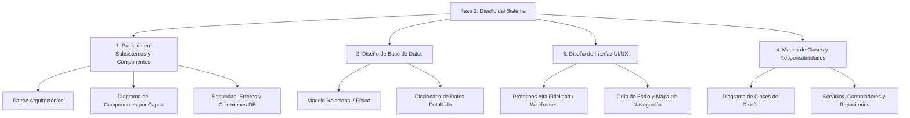
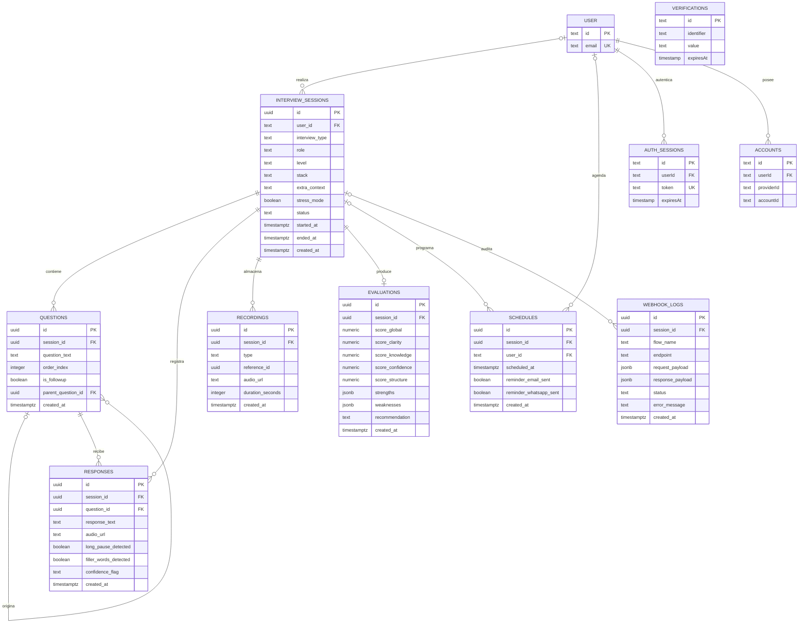
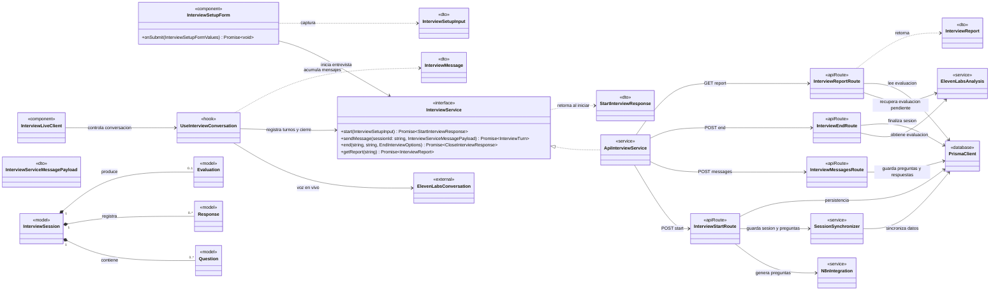

# Fase 2: Diseño del Sistema (Diseño Técnico y Arquitectura)

**Institución:** Universidad Francisco Gavidia (UFG)  
**Facultad:** Facultad de Ingeniería y Sistemas  
**Ciclo:** 02-2026  
**Asignatura:** Aplicación de Técnicas de Ingeniería de Software  
**Grupo:** 01  
**Aula:** A 23-24  
**Horario:** Martes y Jueves 08:10 am – 09:50 am  
**Docente:** Ing. Silvia Janeth Rico de Serrano  
**Contacto Docente:** sserrano@ufg.edu.sv  
**Tipo de Evaluación:** Actividad Evaluada — Fase 2  

---

## 🎯 Objetivo de la Fase

Transformar el **modelo conceptual de análisis** (*el qué*) en una **especificación técnica de arquitectura, componentes y diseño visual completa** (*el cómo*), sirviendo como la **hoja de ruta obligatoria antes de iniciar la codificación**.

---

## 📋 Contenido del Documento Entregable por Equipo

El documento entregable debe estructurarse obligatoriamente en cuatro (4) secciones fundamentales:

---

### 1. Partición del Modelo en Subsistemas y Componentes

Esta sección define la estructura de alto nivel del sistema y cómo interactúan sus bloques de construcción.

* **1.1 Arquitectura del Sistema:**
  * Definición formal del patrón arquitectónico adoptado (ej. Arquitectura en Capas, MVC, Microservicios, Cliente-Servidor, Arquitectura Orientada a Eventos).
  * Justificación técnica de la elección en función de los requerimientos no funcionales (rendimiento, escalabilidad, mantenibilidad, latencia en tiempo real).

* **1.2 Descomposición en Módulos / Subsistemas:**
  * Diagrama formal de componentes UML que organice el sistema en capas bien delimitadas:
    1. **Capa de Presentación:** Clientes web/móvil, interfaces de usuario y componentes visuales.
    2. **Capa de Lógica de Negocio:** Servicios de dominio, orquestadores de procesos, motores de reglas/IA.
    3. **Capa de Acceso a Datos / Persistencia:** Repositorios, clientes ORM/ODM, integraciones con bases de datos y almacenamiento de objetos.
  * Definición de interfaces de comunicación entre capas (protocolos REST, WebSockets, Webhooks, gRPC).

* **1.3 Mecanismos de Control y Recursos Globales:**
  * **Seguridad:** Estrategia de autenticación y autorización (ej. JWT, sesiones seguras, OAuth 2.0, RBAC / control de acceso basado en roles).
  * **Manejo Global de Errores:** Esquema transversal de captura, logging, códigos de estado HTTP estandarizados y respuestas de error uniformes para el cliente.
  * **Gestión de Conexiones a Base de Datos:** Estrategia de pool de conexiones, manejo de variables de entorno, ciclo de vida de conexión y políticas de reintento.

---

### 2. Diseño de la Base de Datos (Estrategia de Administración de Datos)

Esta sección traduce las entidades del negocio en estructuras de persistencia física normalizadas y documentadas.

* **2.1 Modelo Relacional (MR) / Esquema Físico:**
  * Transformación formal del Diagrama Entidad-Relación (DER) conceptual a un modelo de tablas relacionales (SQL) o colecciones/esquemas (NoSQL).
  * Identificación gráfica de relaciones (1:1, 1:N, N:M con tablas intermedias), llaves foráneas y cardinalidades exactas.

* **2.2 Diccionario de Datos Técnico:**
  * Detalle exhaustivo de cada entidad/tabla del sistema que incluya:
    * **Nombre de campos / columnas:** Nomenclatura técnica estándar (ej. snake_case o camelCase consistente).
    * **Tipo de dato físico:** Especificación precisa (ej. `VARCHAR(255)`, `INT`, `BIGINT`, `BOOLEAN`, `TIMESTAMP WITH TIME ZONE`, `UUID`, `JSONB`).
    * **Claves Primarias (PK) y Claves Foráneas (FK):** Indicación explícita de llaves primarias y referencias de llaves foráneas con sus restricciones de integridad referencial (`ON DELETE CASCADE`, `ON UPDATE RESTRICT`, etc.).
    * **Restricciones de nulidad:** Campos obligatorios (`NOT NULL`) y valores predeterminados (`DEFAULT`).
    * **Índices clave:** Índices primarios, índices únicos (`UNIQUE`) e índices de búsqueda/rendimiento para claves foráneas o campos de consulta frecuente.

---

### 3. Diseño de la Interfaz de Usuario (UI/UX)

Esta sección materializa la experiencia del usuario y define los lineamientos visuales y de interacción.

* **3.1 Prototipos de Alta Fidelidad / Wireframes:**
  * Bocetos o prototipos navegables de **todas** las pantallas del sistema:
    * Pantallas de acceso y bienvenida (login, registro, recuperación de cuenta).
    * Tableros principales (*dashboards* con métricas, accesos rápidos y estados).
    * Formularios de captura de datos (configuración, agendamiento, inputs de parámetros).
    * Módulos de consulta y visualización de reportes (resultados, historial, detalle analítico, reproducción multimedia si aplica).
  * Representación de estados de interfaz: carga (*loading skeleton*), estado vacío (*empty state*) y manejo visual de errores.

* **3.2 Guía de Estilo y Navegación:**
  * **Mapa de Sitio / Flujo de Navegación:** Diagrama de transición de estados o diagrama de flujo de usuario (*user flow*) que represente el camino entre pantallas.
  * **Sistema de Diseño Base:**
    * **Paleta de Colores:** Colores primarios, secundarios, neutros, estados de alerta (éxito, advertencia, peligro) con sus respectivos códigos HEX/HSL.
    * **Tipografía:** Familias tipográficas seleccionadas, escala de tamaños (h1 a body/caption) y pesos.
    * **Iconografía y Componentes UI:** Librería de componentes base (botones, modales, tarjetas, inputs).

---

### 4. Mapeo de Clases y Responsabilidades Técnicas

Esta sección establece el puente directo entre el diseño arquitectónico y el código fuente a implementar.

* **4.1 Diagrama de Clases de Diseño (DCD):**
  * Evolución del diagrama conceptual al nivel técnico de implementación:
    * **Visibilidad de atributos y métodos:** Notación UML (`+` public, `-` private, `#` protected).
    * **Tipos de datos explícitos:** Tipado fuerte en atributos y variables.
    * **Firma de métodos:** Nombre del método, parámetros con tipo de dato de entrada y tipo de dato de retorno.
    * **Relaciones entre clases:** Dependencia, agregación, composición, herencia e implementación de interfaces.

* **4.2 Definición de Servicios, Controladores y Repositorios:**
  * Especificación técnica y catálogo de responsabilidades de los componentes de software:
    * **Controladores / APIs (Controllers / Endpoints):** Métodos HTTP (`GET`, `POST`, `PUT`, `DELETE`), rutas, contratos de payload de entrada (*Request DTO*) y contratos de respuesta (*Response DTO*).
    * **Servicios de Negocio (Services):** Lógica pura de dominio, reglas de validación, orquestación de llamadas y casos de uso.
    * **Repositorios de Datos (Repositories / DAOs):** Métodos de persistencia y consultas especializadas a la base de datos.

---

## 🚦 Criterios de Aceptación para la Aprobación de la Fase de Diseño

Para dar por aprobada la Fase 2, cada equipo debe verificar rigurosamente los siguientes tres (3) criterios:

| N° | Criterio | Descripción Exigida |
|:--:|:---|:---|
| **1** | **Consistencia** | Cada elemento diseñado en esta fase debe responder y ser trazable a un requerimiento o caso de uso identificado previamente en la **Fase 1**. No deben existir componentes huérfanos ni requerimientos sin diseño técnico. |
| **2** | **Claridad Técnica** | Nivel de detalle y precisión suficiente para que un **desarrollador externo** pueda construir el software en su totalidad basándose únicamente en estas especificaciones de diseño, sin requerir explicaciones verbales adicionales. |
| **3** | **Formato y Rigor Académico** | Presentación estructurada bajo **Norma APA 7**. Todos los diagramas deben ser legibles, estar debidamente numerados, contar con título formal y notas explicativas correspondientes al pie de cada figura. |

---

## ✅ Matriz de Verificación y Checklist de Entregables

| Sección | Elemento Específico Requerido | Estado | Observaciones / Trazabilidad |
|:---|:---|:---:|:---|
| **1. Subsistemas** | Patrón arquitectónico definido y justificado | `[ ]` | Ej. Cliente-Servidor / Capas / Hexagonal |
| **1. Subsistemas** | Diagrama de componentes por capas (Presentación, Lógica, Datos) | `[ ]` | Notación UML estándar |
| **1. Subsistemas** | Mecanismo de autenticación / autorización (seguridad) | `[ ]` | JWT / OAuth2 / RBAC |
| **1. Subsistemas** | Manejo de errores global y logging | `[ ]` | Middleware / Interceptores globales |
| **1. Subsistemas** | Gestión de conexiones a base de datos | `[ ]` | Connection Pool / ORM |
| **2. Base de Datos** | Modelo Relacional / Físico completo con relaciones | `[x]` | Propuesta PostgreSQL documentada abajo; validar decisiones pendientes antes de migrar |
| **2. Base de Datos** | Diccionario de datos: nombres, tipos, PK, FK, NOT NULL | `[x]` | Tablas de dominio backend; las tablas de Better Auth se excluyen del alcance del backend |
| **2. Base de Datos** | Índices primarios, únicos y de rendimiento definidos | `[x]` | Índices propuestos para claves foráneas y consultas frecuentes |
| **3. UI / UX** | Prototipos navegables / wireframes de alta fidelidad | `[ ]` | Todas las pantallas del sistema |
| **3. UI / UX** | Mapa de navegación / Flujo entre pantallas (Site Map) | `[ ]` | Caminos de usuario |
| **3. UI / UX** | Guía de estilo: paleta de colores (HEX) y tipografías | `[ ]` | Sistema visual consistente |
| **4. Clases** | Diagrama de Clases de Diseño (DCD) con visibilidad y tipos | `[ ]` | UML formal con firmas completas |
| **4. Clases** | Catálogo de Controladores / Endpoints (Rutas, DTOs) | `[ ]` | Contratos de API |
| **4. Clases** | Especificación de Servicios de Negocio | `[ ]` | Casos de uso de negocio |
| **4. Clases** | Especificación de Repositorios / Acceso a datos | `[ ]` | Persistencia y consultas |
| **Criterios** | Trazabilidad con requerimientos de Fase 1 (Consistencia) | `[ ]` | Mapeo 1:1 requerimiento-diseño |
| **Criterios** | Autosuficiencia para desarrollador externo (Claridad Técnica) | `[ ]` | Sin ambigüedades |
| **Criterios** | Cumplimiento de Norma APA 7 en diagramas y formato | `[ ]` | Numeración, títulos y notas |

---

## 📌 Contexto de Aplicación para el Proyecto: Nervio

> [!NOTE]
> Para el sistema **Nervio** (Simulador de Entrevistas Laborales con IA, Voz y Automatización), los requerimientos de esta Fase 2 se alinean con los documentos de arquitectura existentes (`project-flow.md` y `project-overview.md`):

1. **Partición de Subsistemas:**
   * **Frontend:** Next.js (React) + Web Audio API + Better Auth (UI / captura y reproducción de audio).
   * **Backend:** Node.js / NestJS (Tiempo real, WebSockets, orquestación de voz con ElevenLabs, motor conversacional con OpenAI, Session Manager y Modo Estrés).
   * **Automatización:** N8N (Flujos asíncronos: generación previa de preguntas, evaluación profunda de respuestas, generación de feedback hablado, agendamiento y recordatorios vía Resend/Twilio).
2. **Base de Datos (Supabase / PostgreSQL):**
  * Tablas de dominio: `interview_sessions`, `questions`, `responses`, `evaluations`, `recordings`, `schedules` y `webhook_logs`. Better Auth administra por separado `user`, `session`, `account` y `verification`; `session` no es lo mismo que `interview_sessions`.
3. **UI/UX:**
   * Pantallas clave: Login/Registro, Configuración de Entrevista (Rol, Nivel, Stack, Modo Estrés), Sala de Entrevista Interactiva (Esfera virtual / onda de audio reactiva), Tablero de Resultados/Reporte y Reproductor de Sesión (Audio Timeline).
4. **Mapeo de Clases y Servicios:**
   * Controladores: `InterviewController` (`/interview/start`, `/interview/message`, `/interview/end`), `ScheduleController` (`/schedule`), `ReportController`.
   * Servicios: `InterviewEngineService`, `VoiceEngineService`, `AIEngineService`, `SessionManagerService`.

## 2.1 Modelo Relacional (MR) / Esquema Físico

El siguiente modelo refleja las relaciones persistentes de la migración `frontend/prisma/migrations/20260704213008_init/migration.sql`, derivadas del diagrama de clases de la Especificación Técnica, sección 3.3 y del plan backend 001. Se implementa sobre **PostgreSQL en Supabase**. El diccionario refleja los tipos, nulabilidad, acciones referenciales e índices que existen hoy; las recomendaciones adicionales se identifican por separado.

**Figura 1. Modelo relacional implementado para Nervio.** Incluye las tablas de dominio de entrevistas y las cuatro tablas de identidad de Better Auth (`user`, `session`, `account` y `verification`). `VERIFICATIONS` no tiene FK en el esquema actual. `RECORDINGS.reference_id` es una referencia polimórfica sin FK declarada. Las relaciones mostradas como opcionales corresponden a FK nullable en `interview_sessions.user_id`, `schedules.user_id`, `schedules.session_id` y `webhook_logs.session_id`.

## 2.2 Diccionario de Datos Técnico

### Convenciones y alcance

- `PK`: clave primaria; `FK`: clave foránea; `UQ`: restricción única; `NN`: `NOT NULL`.
- En tablas de dominio, los timestamps usan `TIMESTAMPTZ(6)`; las cuatro tablas Better Auth usan `TIMESTAMP(3)` sin zona horaria. La aplicación debe tratar los tiempos como UTC de forma consistente. Los UUID de dominio usan `gen_random_uuid()`.
- Los nombres físicos están en `snake_case`. `USER.id` es `TEXT` para corresponder al identificador tipo cadena de Better Auth; la tabla se escribe como `` `user` `` en el texto para distinguirla de la entidad lógica.
- Los ocho apartados siguientes cubren las tablas de dominio del plan backend; al final se documentan también `user`, `session`, `account` y `verification` de Better Auth. `user.id` es `TEXT` y su nombre físico es `user`.
- En las tablas, `Índice` enumera índices realmente presentes en la migración. Las PK y UQ también crean índices en PostgreSQL. Las sugerencias de índices nuevos se separan en el apartado de recomendaciones.

### Tabla `interview_sessions`

Almacena configuración, estado y ciclo de vida de una entrevista. `user_id` permite sesiones anónimas o heredadas, según la regla de la Especificación Técnica.

| Campo | Tipo PostgreSQL | Nulabilidad / valor | Clave, restricción e índice |
|:---|:---|:---|:---|
| `id` | `UUID` | NN; `gen_random_uuid()` | PK |
| `user_id` | `TEXT` | NULL; sin default | FK `interview_sessions_user_id_fkey` → `user(id)`; `ON DELETE SET NULL`, `ON UPDATE NO ACTION`; índice `idx_sessions_user_id` |
| `interview_type` | `TEXT` | NN | Sin CHECK en la migración |
| `role` | `TEXT` | NN | Sin índice |
| `level` | `TEXT` | NN | Sin CHECK en la migración |
| `stack` | `TEXT` | NULL | Sin índice |
| `extra_context` | `TEXT` | NULL | Sin índice |
| `stress_mode` | `BOOLEAN` | NN; `FALSE` | Sin índice |
| `status` | `TEXT` | NN; `pending` | Índice `idx_sessions_status`; sin CHECK en la migración |
| `started_at` | `TIMESTAMPTZ` | NULL | Sin índice |
| `ended_at` | `TIMESTAMPTZ` | NULL | Sin índice |
| `created_at` | `TIMESTAMPTZ(6)` | NN; `CURRENT_TIMESTAMP` | Sin índice adicional |

### Tabla `questions`

Guarda preguntas iniciales y seguimientos, ordenados dentro de una sesión.

| Campo | Tipo PostgreSQL | Nulabilidad / valor | Clave, restricción e índice |
|:---|:---|:---|:---|
| `id` | `UUID` | NN; `gen_random_uuid()` | PK |
| `session_id` | `UUID` | NN | FK `questions_session_id_fkey` → `interview_sessions(id)`; `ON DELETE CASCADE`, `ON UPDATE NO ACTION`; índice `idx_questions_session_id` |
| `question_text` | `TEXT` | NN | Sin índice |
| `order_index` | `INTEGER` | NN | Sin índice ni unicidad en la migración |
| `is_followup` | `BOOLEAN` | NN; `FALSE` | Sin índice |
| `parent_question_id` | `UUID` | NULL | FK `questions_parent_question_id_fkey` → `questions(id)`; `ON DELETE SET NULL`, `ON UPDATE NO ACTION`; sin índice |
| `created_at` | `TIMESTAMPTZ(6)` | NN; `CURRENT_TIMESTAMP` | Sin índice adicional |

### Tabla `responses`

Conserva transcripciones, referencia al audio y señales usadas por el modo estrés.

| Campo | Tipo PostgreSQL | Nulabilidad / valor | Clave, restricción e índice |
|:---|:---|:---|:---|
| `id` | `UUID` | NN; `gen_random_uuid()` | PK |
| `session_id` | `UUID` | NN | FK `responses_session_id_fkey` → `interview_sessions(id)`; `ON DELETE CASCADE`, `ON UPDATE NO ACTION`; índice `idx_responses_session_id` |
| `question_id` | `UUID` | NN | FK `responses_question_id_fkey` → `questions(id)`; `ON DELETE CASCADE`, `ON UPDATE NO ACTION`; índice `idx_responses_question_id` |
| `response_text` | `TEXT` | NULL | Sin índice |
| `audio_url` | `TEXT` | NULL | Sin índice |
| `long_pause_detected` | `BOOLEAN` | NULL; default `FALSE` | Sin índice |
| `filler_words_detected` | `BOOLEAN` | NULL; default `FALSE` | Sin índice |
| `confidence_flag` | `TEXT` | NULL | Sin índice |
| `created_at` | `TIMESTAMPTZ(6)` | NN; `CURRENT_TIMESTAMP` | Sin índice adicional |

### Tabla `recordings`

Asocia archivos de audio con una sesión. `reference_id` no tiene FK porque puede identificar recursos de tablas distintas.

| Campo | Tipo PostgreSQL | Nulabilidad / valor | Clave, restricción e índice |
|:---|:---|:---|:---|
| `id` | `UUID` | NN; `gen_random_uuid()` | PK |
| `session_id` | `UUID` | NN | FK `recordings_session_id_fkey` → `interview_sessions(id)`; `ON DELETE CASCADE`, `ON UPDATE NO ACTION`; índice `idx_recordings_session_id` |
| `type` | `TEXT` | NN | Sin CHECK; índice `idx_recordings_type` |
| `reference_id` | `UUID` | NULL | Sin FK por referencia polimórfica; sin índice |
| `audio_url` | `TEXT` | NN | Sin índice |
| `duration_seconds` | `INTEGER` | NULL | Sin CHECK en la migración |
| `created_at` | `TIMESTAMPTZ(6)` | NN; `CURRENT_TIMESTAMP` | Sin índice adicional |

### Tabla `evaluations`

Contiene la evaluación final escrita por N8N. La relación 1:0..1 se garantiza con la unicidad de `session_id`.

| Campo | Tipo PostgreSQL | Nulabilidad / valor | Clave, restricción e índice |
|:---|:---|:---|:---|
| `id` | `UUID` | NN; `gen_random_uuid()` | PK |
| `session_id` | `UUID` | NN | FK `evaluations_session_id_fkey` → `interview_sessions(id)`; `ON DELETE CASCADE`, `ON UPDATE NO ACTION`; UQ `evaluations_session_id_key`; índice adicional redundante `idx_evaluations_session_id` |
| `score_global` | `DECIMAL(5,2)` | NULL | Sin CHECK ni índice |
| `score_clarity` | `DECIMAL(5,2)` | NULL | Sin CHECK ni índice |
| `score_knowledge` | `DECIMAL(5,2)` | NULL | Sin CHECK ni índice |
| `score_confidence` | `DECIMAL(5,2)` | NULL | Sin CHECK ni índice |
| `score_structure` | `DECIMAL(5,2)` | NULL | Sin CHECK ni índice |
| `strengths` | `TEXT` | NULL | Sin índice |
| `weaknesses` | `TEXT` | NULL | Sin índice |
| `recommendation` | `TEXT` | NULL | Sin índice |
| `created_at` | `TIMESTAMPTZ(6)` | NN; `CURRENT_TIMESTAMP` | Sin índice adicional |

### Tabla `schedules`

Representa una reserva futura, asociada al candidato y a la sesión planificada.

| Campo | Tipo PostgreSQL | Nulabilidad / valor | Clave, restricción e índice |
|:---|:---|:---|:---|
| `id` | `UUID` | NN; `gen_random_uuid()` | PK |
| `session_id` | `UUID` | NULL | FK `schedules_session_id_fkey` → `interview_sessions(id)`; `ON DELETE CASCADE`, `ON UPDATE NO ACTION`; sin índice independiente |
| `user_id` | `TEXT` | NULL | FK `schedules_user_id_fkey` → `user(id)`; `ON DELETE SET NULL`, `ON UPDATE NO ACTION`; sin índice independiente |
| `scheduled_at` | `TIMESTAMPTZ(6)` | NN | Índice `idx_schedules_scheduled_at`; sin CHECK de fecha en la migración |
| `reminder_email_sent` | `BOOLEAN` | NN; `FALSE` | Sin índice |
| `reminder_whatsapp_sent` | `BOOLEAN` | NN; `FALSE` | Índice compuesto `idx_schedules_reminders` junto con `reminder_email_sent` |
| `created_at` | `TIMESTAMPTZ(6)` | NN; `CURRENT_TIMESTAMP` | Sin índice adicional |

### Tabla `webhook_logs`

Audita solicitudes y resultados de integraciones asíncronas. Los payloads pueden contener datos personales; deben limitarse y redactarse según la política de logging.

| Campo | Tipo PostgreSQL | Nulabilidad / valor | Clave, restricción e índice |
|:---|:---|:---|:---|
| `id` | `UUID` | NN; `gen_random_uuid()` | PK |
| `session_id` | `UUID` | NULL | FK `webhook_logs_session_id_fkey` → `interview_sessions(id)`; `ON DELETE CASCADE`, `ON UPDATE NO ACTION`; índice `idx_webhook_logs_session_id` |
| `flow_name` | `TEXT` | NN | Índice `idx_webhook_logs_flow_name` |
| `endpoint` | `TEXT` | NN | Sin índice |
| `request_payload` | `JSONB` | NULL | Sin índice |
| `response_payload` | `JSONB` | NULL | Sin índice |
| `status` | `TEXT` | NN; `sent` | Sin índice; valores permitidos por definir |
| `error_message` | `TEXT` | NULL | Sin índice |
| `created_at` | `TIMESTAMPTZ(6)` | NN; `CURRENT_TIMESTAMP` | Sin índice adicional |

### Tablas de identidad Better Auth

Estas cuatro tablas forman parte de la migración física, aunque el backend 001 las excluye de su alcance funcional. Los nombres de columna conservan camelCase en PostgreSQL.

**`user`**

| Campo | Tipo PostgreSQL | Nulabilidad / valor | Clave, restricción e índice |
|:---|:---|:---|:---|
| `id` | `TEXT` | NN | PK |
| `name` | `TEXT` | NN | Sin índice |
| `email` | `TEXT` | NN | UNIQUE `user_email_key` |
| `emailVerified` | `BOOLEAN` | NN; `FALSE` | Sin índice |
| `image` | `TEXT` | NULL | Sin índice |
| `createdAt` | `TIMESTAMP(3)` | NN; `CURRENT_TIMESTAMP` | Sin índice |
| `updatedAt` | `TIMESTAMP(3)` | NN; sin default | Sin índice |

**`session`**

| Campo | Tipo PostgreSQL | Nulabilidad / valor | Clave, restricción e índice |
|:---|:---|:---|:---|
| `id` | `TEXT` | NN | PK |
| `expiresAt` | `TIMESTAMP(3)` | NN | Sin índice |
| `token` | `TEXT` | NN | UNIQUE `session_token_key` |
| `createdAt` | `TIMESTAMP(3)` | NN; `CURRENT_TIMESTAMP` | Sin índice |
| `updatedAt` | `TIMESTAMP(3)` | NN; sin default | Sin índice |
| `ipAddress` | `TEXT` | NULL | Sin índice |
| `userAgent` | `TEXT` | NULL | Sin índice |
| `userId` | `TEXT` | NN | FK `session_userId_fkey` → `user(id)`; `ON DELETE CASCADE`, `ON UPDATE CASCADE`; índice `session_userId_idx` |

**`account`**

| Campo | Tipo PostgreSQL | Nulabilidad / valor | Clave, restricción e índice |
|:---|:---|:---|:---|
| `id` | `TEXT` | NN | PK |
| `accountId` | `TEXT` | NN | Sin índice |
| `providerId` | `TEXT` | NN | Sin índice |
| `userId` | `TEXT` | NN | FK `account_userId_fkey` → `user(id)`; `ON DELETE CASCADE`, `ON UPDATE CASCADE`; índice `account_userId_idx` |
| `accessToken` | `TEXT` | NULL | Sin índice |
| `refreshToken` | `TEXT` | NULL | Sin índice |
| `idToken` | `TEXT` | NULL | Sin índice |
| `accessTokenExpiresAt` | `TIMESTAMP(3)` | NULL | Sin índice |
| `refreshTokenExpiresAt` | `TIMESTAMP(3)` | NULL | Sin índice |
| `scope` | `TEXT` | NULL | Sin índice |
| `password` | `TEXT` | NULL | Sin índice |
| `createdAt` | `TIMESTAMP(3)` | NN; `CURRENT_TIMESTAMP` | Sin índice |
| `updatedAt` | `TIMESTAMP(3)` | NN; sin default | Sin índice |

**`verification`**

| Campo | Tipo PostgreSQL | Nulabilidad / valor | Clave, restricción e índice |
|:---|:---|:---|:---|
| `id` | `TEXT` | NN | PK |
| `identifier` | `TEXT` | NN | Índice `verification_identifier_idx` |
| `value` | `TEXT` | NN | Sin índice |
| `expiresAt` | `TIMESTAMP(3)` | NN | Sin índice |
| `createdAt` | `TIMESTAMP(3)` | NN; `CURRENT_TIMESTAMP` | Sin índice |
| `updatedAt` | `TIMESTAMP(3)` | NN; sin default | Sin índice |

### Restricciones e índices implementados

- Las PK de tablas de dominio son UUID generados con `gen_random_uuid()`; las PK Better Auth son `TEXT`. `evaluations.session_id` es único. No hay CHECK constraints ni unicidad para el orden de preguntas en la migración inicial.
- Índices físicos de dominio: `interview_sessions(status)`, `interview_sessions(user_id)`, `evaluations(session_id)` único y además uno no único, `questions(session_id)`, `recordings(session_id)`, `recordings(type)`, `responses(question_id)`, `responses(session_id)`, `schedules(reminder_email_sent, reminder_whatsapp_sent)`, `schedules(scheduled_at)`, `webhook_logs(flow_name)`, `webhook_logs(session_id)`.
- Índices físicos Better Auth: `user(email)` único, `session(userId)`, `session(token)` único, `account(userId)`, `verification(identifier)`.
- `ON DELETE CASCADE` se aplica a sesión/login y sus cuentas, y a entidades dependientes de entrevistas (preguntas, respuestas, evaluaciones, grabaciones, reservas y logs). `interview_sessions.user_id` y `schedules.user_id` usan `ON DELETE SET NULL`. Las FK de dominio usan `ON UPDATE NO ACTION`; las FK de autenticación usan `ON UPDATE CASCADE`.

### Recomendaciones para una siguiente migración

- Evaluar reemplazar el índice no único `idx_evaluations_session_id`, redundante por `evaluations_session_id_key`.
- Añadir unicidad `questions(session_id, order_index)` solo si el contrato garantiza un único número de orden por pregunta dentro de cada sesión.
- Considerar índices compuestos `responses(session_id, created_at)`, `recordings(session_id, created_at)` y `schedules(user_id, scheduled_at)` si las consultas reales de historial los justifican. La migración actual solo indexa `scheduled_at` y la pareja de flags de recordatorio.
- Definir CHECKs para tipos de entrevista, nivel, tipo de grabación, rangos de puntuación y duración; el esquema actual guarda esas columnas como texto/número sin CHECK.
- No se recomienda indexar texto largo ni payload JSONB hasta que exista una consulta concreta que lo justifique.

### Decisiones que deben cerrarse antes de migrar

1. Unificar el vocabulario de `status`: la especificación describe `created → running → ending → completed`, mientras la base actual usa `pending` por defecto y no impone CHECK.
2. Decidir si `schedules.session_id` y `schedules.user_id` deben ser obligatorios: ambos admiten `NULL` actualmente.
3. Definir valores válidos para `interview_type`, `level`, `recordings.type`, `confidence_flag` y `webhook_logs.status`, además de si scores, strengths, weaknesses y recommendation son obligatorios. Hoy no existen CHECK constraints y varios campos evaluativos admiten NULL.
4. Confirmar la política de retención de `webhook_logs` y si `recordings.reference_id` debe sustituirse por referencias normalizadas con FK.
5. Resolver si se conserva el índice redundante en `evaluations.session_id` y medir las recomendaciones de índices antes de agregarlas.

## 4.1 Diagrama de Clases de Diseño del Frontend Actual

```mermaid
classDiagram
  direction TB

  class HomePage <<page>>
  class LoginPage <<page>>
  class RegisterPage <<page>>
  class InterviewSetupPage <<page>>
  class InterviewLivePage <<page>>
  class InterviewEndedPage <<page>>
  class InterviewReportPage <<page>>
  class InterviewReportsPage <<page>>
  class InterviewSchedulesPage <<page>>

  class LoginForm <<component>> {
    +LoginForm() JSXElement
    -onSubmit(LoginFormValues) Promise~void~
  }
  class RegisterForm <<component>> {
    +RegisterForm() JSXElement
    -onSubmit(RegisterFormValues) Promise~void~
  }
  class InterviewSetupForm <<component>> {
    +render(InterviewSetupFormProps) JSXElement
    -onSubmit(InterviewSetupFormValues) Promise~void~
  }
  class InterviewLiveClient <<component>> {
    +render(InterviewLiveClientProps) JSXElement
    -loadSession() Promise~void~
  }
  class InterviewLiveShell <<component>> {
    +render(InterviewLiveShellProps) JSXElement
  }
  class InterviewControls <<component>> {
    +render(InterviewControlsProps) JSXElement
  }
  class InterviewOrb <<component>> {
    +render(InterviewOrbProps) JSXElement
  }
  class InterviewBubble <<component>> {
    +render(InterviewBubbleProps) JSXElement
  }
  class InterviewTimeline <<component>> {
    +render(InterviewTimelineProps) JSXElement
  }
  class InterviewReportClient <<component>> {
    +render(InterviewReportClientProps) JSXElement
  }
  class AuthCard <<component>>
  class SiteHeader <<component>>
  class SiteFooter <<component>>
  class AuthBackground <<component>>
  class HomeHeroActions <<component>>
  class FeatureCards <<component>>
  class UiPrimitives <<component>>

  class InterviewService <<interface>> {
    +start(input: InterviewSetupInput) Promise~StartInterviewResponse~
    +sendMessage(sessionId: string, payload: InterviewServiceMessagePayload) Promise~InterviewTurn~
    +end(sessionId: string, conversationId: NullableString, options: EndInterviewOptions) Promise~CloseInterviewResponse~
    +getReport(sessionId: string) Promise~InterviewReport~
    +getOpeningQuestion(sessionId: string) Promise~string~
    +getSession(sessionId: string) Promise~PersistedInterviewSession~
    +schedule(input: ScheduleInterviewInput) Promise~ScheduleInterviewResponse~
  }
  class ApiInterviewService <<service>> {
    +start(input: InterviewSetupInput) Promise~StartInterviewResponse~
    +sendMessage(sessionId: string, payload: InterviewServiceMessagePayload) Promise~InterviewTurn~
    +end(sessionId: string, conversationId: NullableString, options: EndInterviewOptions) Promise~CloseInterviewResponse~
    +getReport(sessionId: string) Promise~InterviewReport~
    +getOpeningQuestion(sessionId: string) Promise~string~
    +getSession(sessionId: string) Promise~PersistedInterviewSession~
    +schedule(input: ScheduleInterviewInput) Promise~ScheduleInterviewResponse~
    -apiJson~T~(url: string, init: RequestInit) Promise~T~
  }
  class MockInterviewService <<service>> {
    +start(input: InterviewSetupInput) Promise~StartInterviewResponse~
    +sendMessage(sessionId: string, payload: InterviewServiceMessagePayload) Promise~InterviewTurn~
    +end(sessionId: string) Promise~CloseInterviewResponse~
    +getReport(sessionId: string) Promise~InterviewReport~
    +getOpeningQuestion(sessionId: string) Promise~string~
    +getSession(sessionId: string) Promise~PersistedInterviewSession~
    +schedule(input: ScheduleInterviewInput) Promise~ScheduleInterviewResponse~
  }
  class InterviewServiceFactory <<factory>> {
    +getInterviewService() InterviewService
  }
  class UseInterviewConversation <<hook>> {
    +useInterviewConversation(sessionId: string, initialSetup: InterviewSetupInput) InterviewConversationState
    -activateMicrophone() Promise~void~
    -toggleMute() void
    -endInterview() void
  }
  class SessionStorage <<module>> {
    +getSession(sessionId: string) NullableMockSessionState
    +saveSession(session: MockSessionState) void
    +persistStartSession(setup: InterviewSetupInput, data: StartSessionData) MockSessionState
    +getSessionMessages(sessionId: string) Array~InterviewMessage~
    +getSessionSetup(sessionId: string) NullableInterviewSetupInput
  }
  class InterviewTypes <<types>>
  class InterviewSetupInput <<dto>> {
    +string role
    +string candidateName
    +ExperienceLevel level
    +InterviewLanguage language
    +InterviewType interviewType
    +OptionalString stack
    +string extraContext
  }
  class InterviewMessage <<dto>> {
    +String id
    +MessageRole role
    +string text
    +number timestamp
  }
  class InterviewQuestion <<dto>> {
    +String session_id
    +String question_text
    +Number order_index
    +Boolean is_followup
  }
  class InterviewReport <<dto>> {
    +String sessionId
    +Number scoreGlobal
    +Array~String~ strengths
    +Array~String~ weaknesses
    +String recommendation
  }
  class InterviewServiceMessagePayload {
    <<inlineType>>
    +OptionalInterviewMessageRole role
    +OptionalString text
    +OptionalBlob audioBlob
  }
  class StartInterviewResponse <<dto>> {
    +String sessionId
    +Array~InterviewQuestion~ questions
    +String text
    +OptionalString audioUrl
  }
  class InterviewTurn <<dto>> {
    +String interviewerMessage
    +Boolean isComplete
    +InterviewPhase phase
  }
  class PersistedInterviewSession <<dto>> {
    +String id
    +InterviewSetupInput setup
    +Array~InterviewMessage~ messages
    +Array~InterviewQuestion~ questions
    +String status
  }
  class InterviewConversationState <<inferredType>>
  class JSXElement <<typeAlias>>
  class StartSessionData <<inlineType>>
  class InterviewMessageRole <<typeAlias>>
  class OptionalInterviewMessageRole <<typeAlias>>
  class OptionalString <<typeAlias>>
  class OptionalBlob <<typeAlias>>
  class OptionalNumber <<typeAlias>>
  class NullableMockSessionState <<typeAlias>>
  class NullableInterviewSetupInput <<typeAlias>>
  class NullableLocalEvaluation <<typeAlias>>
  class NullableString <<typeAlias>>
  class StringRecord <<typeAlias>>
  class PersistedInterviewSessionStatus <<typeAlias>>
  class InterviewSetupSchema <<schema>>
  class AuthSchemas <<schema>>

  class AuthClient <<client>>
  class AuthServer <<config>>
  class AuthGuardHelper <<helper>> {
    +requireAuth(callbackPath: string) Promise~AuthSession~
  }
  class PrismaClient <<singleton>>
  class N8nIntegration <<integration>> {
    +callN8nGenerateInterview(payload: N8nGenerateInterviewBody) Promise~N8nGenerateInterviewResponse~
    +toN8nGenerateInterviewPayload(form: InterviewSetupInput, userId: string) N8nGenerateInterviewBody
    +buildExtraContext(form: InterviewSetupInput) string
  }
  class ElevenLabsVoice <<integration>> {
    +synthesizeSpeech(text: string, languageCode: string) Promise~ArrayBuffer~
    +arrayBufferToDataUrlNode(buffer: ArrayBuffer, mimeType: string) string
  }
  class ElevenLabsAnalysis <<service>> {
    +fetchElevenLabsEvaluation(conversationId: string, attempts: OptionalNumber) Promise~NullableLocalEvaluation~
    +saveEvaluation(sessionId: string, evaluation: LocalEvaluation) Promise~void~
    +rememberElevenLabsConversation(sessionId: string, conversationId: string) Promise~void~
    +getRememberedElevenLabsConversationId(sessionId: string) Promise~NullableString~
  }
  class SessionSynchronizer <<service>> {
    +syncN8nSessionToPrisma(response: N8nGenerateInterviewResponse, setup: InterviewSetupInput, userId: string) Promise~void~
  }
  class ReportMapper <<service>> {
    +toInterviewReport(session: ReportSource) InterviewReport
    +buildElevenLabsEvaluation(conversation: ElevenLabsConversationAnalysis) NullableLocalEvaluation
    +buildLocalEvaluation(responseTexts: Array~string~) LocalEvaluation
    +parseStoredList(value: string) Array~string~
  }

  class AuthApiRoute <<apiRoute>> {
    +GET(request: Request) Promise~Response~
    +POST(request: Request) Promise~Response~
  }
  class InterviewStartRoute <<apiRoute>> {
    +POST(request: Request) Promise~Response~
    -generateInterview(setup: InterviewSetupInput, userId: string) Promise~N8nGenerateInterviewResponse~
  }
  class InterviewMessagesRoute <<apiRoute>> {
    +POST(request: Request, context: RouteContext) Promise~Response~
    -nextQuestionOrder(sessionId: string) Promise~number~
  }
  class InterviewSessionRoute <<apiRoute>> {
    +GET(request: Request, context: RouteContext) Promise~Response~
    -mapStatus(status: string) PersistedInterviewSessionStatus
  }
  class InterviewEndRoute <<apiRoute>> {
    +POST(request: Request, context: RouteContext) Promise~Response~
  }
  class InterviewReportRoute <<apiRoute>> {
    +GET(request: Request, context: RouteContext) Promise~Response~
  }
  class InterviewReportsRoute <<apiRoute>> {
    +GET(request: Request) Promise~Response~
  }
  class ScheduleRoute <<apiRoute>> {
    +POST(request: Request) Promise~Response~
    -notifySchedule(sessionId: string, payload: StringRecord) Promise~void~
  }
  class ElevenLabsTokenRoute <<apiRoute>> {
    +GET(request: Request) Promise~Response~
  }

  class User <<model>> {
    +String id
    +String name
    +String email
  }
  class LoginSession <<model>> {
    +String id
    +String userId
    +DateTime expiresAt
  }
  class Account <<model>> {
    +String id
    +String userId
    +String providerId
  }
  class Verification <<model>> {
    +String id
    +String identifier
    +DateTime expiresAt
  }
  class InterviewSession <<model>> {
    +UUID id
    +String interviewType
    +String role
    +String level
    +String status
    +DateTime createdAt
  }
  class Question <<model>> {
    +UUID id
    +UUID sessionId
    +String questionText
    +Int orderIndex
  }
  class Response <<model>> {
    +UUID id
    +UUID sessionId
    +UUID questionId
    +String responseText
  }
  class Recording <<model>> {
    +UUID id
    +UUID sessionId
    +String type
    +String audioUrl
  }
  class Evaluation <<model>> {
    +UUID id
    +UUID sessionId
    +Decimal scoreGlobal
    +String recommendation
  }
  class Schedule <<model>> {
    +UUID id
    +UUID sessionId
    +String userId
    +DateTime scheduledAt
  }
  class WebhookLog <<model>> {
    +UUID id
    +UUID sessionId
    +String flowName
    +String status
  }
  class ElevenLabsConversationSDK <<external>>
  class ElevenLabsAPI <<external>>

  LoginPage --> LoginForm : renderiza
  RegisterPage --> RegisterForm : renderiza
  InterviewSetupPage --> InterviewSetupForm : renderiza
  InterviewLivePage --> InterviewLiveClient : renderiza
  InterviewReportPage --> InterviewReportClient : renderiza
  InterviewSetupForm --> InterviewService : inicia o agenda
  InterviewServiceFactory ..> ApiInterviewService : seleccion por defecto
  InterviewServiceFactory ..> MockInterviewService : seleccion con mock flag
  InterviewService <|.. ApiInterviewService
  InterviewService <|.. MockInterviewService
  ApiInterviewService --> SessionStorage : cache local de sesion
  MockInterviewService --> SessionStorage : persiste mock
  InterviewLiveClient --> UseInterviewConversation : controla conversacion
  InterviewLiveClient --> InterviewLiveShell : compone
  UseInterviewConversation --> InterviewService : persiste turnos y cierre
  UseInterviewConversation --> SessionStorage : lee y guarda estado
  UseInterviewConversation ..> ElevenLabsConversationSDK : voz en tiempo real
  InterviewLiveShell --> InterviewControls : muestra controles
  InterviewLiveShell --> InterviewOrb : muestra estado
  InterviewLiveShell --> InterviewBubble : muestra pregunta
  InterviewLiveShell --> InterviewTimeline : muestra mensajes
  InterviewReportClient --> InterviewService : consulta reporte
  LoginForm --> AuthClient : signIn.email
  RegisterForm --> AuthClient : signUp.email
  InterviewSetupForm ..> InterviewSetupSchema : valida
  InterviewSetupForm ..> InterviewSetupInput : envia
  LoginForm ..> AuthSchemas : valida login
  RegisterForm ..> AuthSchemas : valida registro
  InterviewService ..> InterviewTypes : contratos
  InterviewService ..> InterviewReport : contrato de reporte
  UseInterviewConversation ..> InterviewMessage : mantiene conversacion
  ApiInterviewService ..> InterviewQuestion : recibe preguntas

  InterviewSetupPage --> AuthGuardHelper : exige autenticacion
  InterviewLivePage --> AuthGuardHelper : exige autenticacion
  InterviewReportPage --> AuthGuardHelper : exige autenticacion
  InterviewReportsPage --> AuthGuardHelper : exige autenticacion
  InterviewSchedulesPage --> AuthGuardHelper : exige autenticacion
  InterviewReportsPage --> PrismaClient : consulta historial
  InterviewSchedulesPage --> PrismaClient : consulta reservas

  AuthApiRoute --> AuthServer : delega autenticacion
  InterviewStartRoute --> AuthServer : verifica usuario
  InterviewStartRoute --> InterviewSetupSchema : valida entrada
  InterviewStartRoute --> N8nIntegration : solicita preguntas
  InterviewStartRoute --> SessionSynchronizer : sincroniza sesion y preguntas
  InterviewStartRoute --> ElevenLabsVoice : audio de apertura
  InterviewStartRoute --> PrismaClient : persistencia
  InterviewMessagesRoute --> AuthServer : verifica usuario
  InterviewMessagesRoute --> PrismaClient : persiste pregunta o respuesta
  InterviewSessionRoute --> AuthServer : verifica usuario
  InterviewSessionRoute --> PrismaClient : carga sesion y relaciones
  InterviewEndRoute --> AuthServer : verifica usuario
  InterviewEndRoute --> ElevenLabsAnalysis : evalua y guarda
  InterviewEndRoute --> PrismaClient : cierra sesion
  InterviewReportRoute --> AuthServer : verifica usuario
  InterviewReportRoute --> ElevenLabsAnalysis : recupera analisis pendiente
  InterviewReportRoute --> ReportMapper : adapta reporte
  InterviewReportRoute --> PrismaClient : consulta evaluacion
  InterviewReportsRoute --> AuthServer : verifica usuario
  InterviewReportsRoute --> PrismaClient : consulta historial
  ScheduleRoute --> AuthServer : verifica usuario
  ScheduleRoute --> InterviewSetupSchema : valida configuracion y fecha
  ScheduleRoute --> PrismaClient : crea cita y log
  ScheduleRoute --> N8nIntegration : webhook de recordatorio
  ElevenLabsTokenRoute --> AuthServer : verifica usuario
  ElevenLabsTokenRoute ..> ElevenLabsAPI : obtiene token

  User "1" --> "0..*" LoginSession : tiene
  User "1" --> "0..*" Account : vincula
  InterviewSession "0..*" --> "0..1" User : pertenece
  InterviewSession "1" *-- "0..*" Question : contiene
  Question "0..1" --> "0..*" Question : seguimiento
  Question "1" --> "0..*" Response : recibe
  InterviewSession "1" *-- "0..*" Response : conserva
  InterviewSession "1" *-- "0..*" Recording : conserva
  InterviewSession "1" *-- "0..1" Evaluation : produce
  User "0..1" --> "0..*" Schedule : agenda
  InterviewSession "0..1" --> "0..*" Schedule : referencia
  InterviewSession "0..1" --> "0..*" WebhookLog : audita
```

El diagrama resume la implementación presente en `frontend/src`: páginas Next.js, componentes y hooks React funcionales, servicios, Route Handlers, validaciones y modelos Prisma. React usa funciones, no clases, para componentes y hooks; el estereotipo `<<component>>` identifica funciones de presentación, y las firmas indican su contrato callable, no métodos de instancias. En las firmas UML, `+` identifica función exportada/contrato público y `-` callback o helper local no exportado. Los campos de los modelos Prisma se muestran como públicos porque son propiedades del modelo generado; la implementación frontend no declara atributos privados de instancia en estas unidades funcionales, por lo que no se inventan. Los tipos marcados `inline-type`, `inferred-type` o `type-alias` nombran estructuras inline/inferidas o alias de presentación para hacer legible el DCD; no necesariamente corresponden a declaraciones TypeScript con esos identificadores. No se incluyen archivos generados por Prisma ni funcionalidades solo planificadas.

**Figura 2. Diagrama de clases de diseño del frontend implementado.** Se incluyen rutas y servicios presentes en Next.js, el flujo real de autenticación y persistencia, y los modelos Prisma usados por la aplicación. `InterviewService` tiene dos implementaciones: API (predeterminada) y mock (cuando `NEXT_PUBLIC_USE_MOCK_INTERVIEW=true`). El endpoint de inicio actualmente invoca N8N desde Next.js y usa ElevenLabs para sintetizar la pregunta inicial; el canal de conversación en vivo usa el SDK `@elevenlabs/react`. `UiPrimitives` agrupa `Button`, `Input`, `Select`, `Textarea`, `Field`, `Spinner` y otros componentes base.

### Vista resumida del pipeline de entrevistas

Este diagrama reduce el DCD a los componentes principales que participan en una entrevista: configuración, inicio y generación de preguntas, conversación en vivo, persistencia de turnos, cierre y reporte.

**Figura 3. Vista resumida de clases del pipeline de entrevista.** Omite autenticación, agenda, páginas secundarias, componentes UI auxiliares y adaptador mock para destacar el camino principal de una entrevista real.

### Vista resumida del pipeline en PlantUML

```plantuml
@startuml
left to right direction

class InterviewSetupForm <<component>> {
  -onSubmit(values: InterviewSetupFormValues): Promise<void>
}

interface InterviewService {
  +start(input: InterviewSetupInput): Promise<StartInterviewResponse>
  +sendMessage(sessionId: string, payload: InterviewServiceMessagePayload): Promise<InterviewTurn>
  +end(sessionId: string, conversationId: string, options: EndInterviewOptions): Promise<CloseInterviewResponse>
  +getReport(sessionId: string): Promise<InterviewReport>
}

class ApiInterviewService <<service>>
class InterviewLiveClient <<component>>
class UseInterviewConversation <<hook>>
class InterviewStartRoute <<apiRoute>>
class InterviewMessagesRoute <<apiRoute>>
class InterviewEndRoute <<apiRoute>>
class InterviewReportRoute <<apiRoute>>
class N8nIntegration <<service>>
class ElevenLabsConversation <<external>>
class ElevenLabsAnalysis <<service>>
class SessionSynchronizer <<service>>
class PrismaClient <<database>>

class InterviewSetupInput <<dto>>
class StartInterviewResponse <<dto>>
class InterviewMessage <<dto>>
class InterviewServiceMessagePayload <<dto>>
class InterviewReport <<dto>>
class InterviewSession <<model>>
class Question <<model>>
class Response <<model>>
class Evaluation <<model>>

InterviewSetupForm --> InterviewService : inicia entrevista
InterviewService <|.. ApiInterviewService
ApiInterviewService --> InterviewStartRoute : POST start
ApiInterviewService --> InterviewMessagesRoute : POST messages
ApiInterviewService --> InterviewEndRoute : POST end
ApiInterviewService --> InterviewReportRoute : GET report
InterviewLiveClient --> UseInterviewConversation : controla conversacion
UseInterviewConversation --> ElevenLabsConversation : voz en vivo
UseInterviewConversation --> InterviewService : registra turnos y cierre
InterviewStartRoute --> N8nIntegration : genera preguntas
InterviewStartRoute --> SessionSynchronizer : guarda sesion y preguntas
InterviewEndRoute --> ElevenLabsAnalysis : obtiene evaluacion
InterviewReportRoute --> ElevenLabsAnalysis : recupera evaluacion pendiente
InterviewStartRoute --> PrismaClient : persistencia
InterviewMessagesRoute --> PrismaClient : guarda preguntas y respuestas
InterviewEndRoute --> PrismaClient : finaliza sesion
InterviewReportRoute --> PrismaClient : lee evaluacion
SessionSynchronizer --> PrismaClient : sincroniza datos

InterviewSetupForm ..> InterviewSetupInput : captura
InterviewService ..> StartInterviewResponse : retorna al iniciar
UseInterviewConversation ..> InterviewMessage : acumula mensajes
InterviewReportRoute ..> InterviewReport : retorna
InterviewSession "1" *-- "0..*" Question : contiene
InterviewSession "1" *-- "0..*" Response : registra
InterviewSession "1" *-- "0..1" Evaluation : produce
@enduml
```

**Figura 4. Vista resumida de clases del pipeline de entrevista en PlantUML.** Representa el mismo alcance y relaciones que la Figura 3, usando sintaxis PlantUML.

## 4.2 Definición de Servicios, Controladores y Acceso a Datos

### Controladores y endpoints HTTP

En Next.js App Router, los controladores HTTP se implementan como funciones `GET` y `POST` exportadas por Route Handlers. Las firmas de esta tabla corresponden a `Request` y, para rutas dinámicas, `context.params: Promise<{ sessionId: string }>`. Toda respuesta HTTP es `NextResponse` (subtipo de `Response`). Las rutas privadas resuelven la identidad con Better Auth y filtran entrevistas por `userId`.

| Controlador / Ruta | Método y endpoint | Entrada | Salida exitosa | Responsabilidad e integración |
|:---|:---|:---|:---|:---|
| `AuthApiRoute` `/api/auth/[...all]` | GET, POST `/api/auth/*` | Request de Better Auth | Respuesta de Better Auth | Exporta GET/POST producidos por `toNextJsHandler(auth)`; Better Auth administra autenticación, sesiones, cuentas, usuarios y verificaciones. |
| `InterviewStartRoute` `/api/interview/start` | `POST /api/interview/start` | JSON `InterviewSetupInput`; sesión de usuario autenticado | `StartInterviewResponse` (`sessionId`, preguntas, pregunta inicial y `audioUrl`) | Valida con `interviewSetupSchema`; obtiene preguntas de N8N o usa preguntas mock si no está configurado/falla; sincroniza sesión y preguntas con Prisma; sintetiza audio inicial mediante ElevenLabs cuando está configurado. Errores: 400, 401, 502 o 500. |
| `InterviewMessagesRoute` `/api/interview/[sessionId]/messages` | `POST /api/interview/{sessionId}/messages` | JSON `{ role?: "interviewer" | "candidate", text: string }` | `InterviewTurn` (`isComplete`, `phase`) | Verifica propiedad de la entrevista; guarda preguntas/follow-ups o transcripciones en Prisma. No procesa audio ni genera respuesta del agente. Errores: 400, 401, 404 o 500. |
| `InterviewSessionRoute` `/api/interview/[sessionId]` | `GET /api/interview/{sessionId}` | `sessionId` de ruta y sesión autenticada | `PersistedInterviewSession` | Carga entrevista, preguntas, respuestas, primera reserva y usuario; transforma los registros al contrato usado por la interfaz. Errores: 401, 404 o 500. |
| `InterviewEndRoute` `/api/interview/[sessionId]/end` | `POST /api/interview/{sessionId}/end` | JSON `{ conversationId?: string, reason?: InterviewEndReason, skipEvaluation?: boolean }` | `CloseInterviewResponse` | Marca la entrevista como finalizada; registra identificador de conversación ElevenLabs; opcionalmente consulta y guarda evaluación. Errores: 401, 404 o 500. |
| `InterviewReportRoute` `/api/interview/[sessionId]/report` | `GET /api/interview/{sessionId}/report` | `sessionId` de ruta y sesión autenticada | `InterviewReport` | Recupera evaluación; intenta obtener análisis pendiente de ElevenLabs y persistirlo; adapta datos mediante `toInterviewReport`. Errores: 401, 404 o 500. |
| `InterviewReportsRoute` `/api/interview/reports` | `GET /api/interview/reports` | Sesión autenticada | `{ reports: InterviewReportSummary[] }` | Lista entrevistas finalizadas del usuario, ordenadas por fecha y con puntuación disponible. Errores: 401 o 500. |
| `ScheduleRoute` `/api/interview/schedule` | `POST /api/interview/schedule` | JSON `ScheduleInterviewInput` | `ScheduleInterviewResponse` (`sessionId`, `scheduleId`, `scheduledAt`) | Valida configuración y fecha futura; crea `InterviewSession` y `Schedule`; notifica webhook N8N y registra resultado/error en `webhook_logs`. Errores: 400, 401 o 500. |
| `ElevenLabsTokenRoute` `/api/elevenlabs/token` | `GET /api/elevenlabs/token` | Sesión autenticada | `{ token: string }` | Solicita token de conversación a ElevenLabs sin exponer la API key. Errores: 401, 502 o 500. |

### Servicios y responsabilidades

| Servicio / módulo | Operaciones públicas principales | Responsabilidad / dependencias |
|:---|:---|:---|
| `InterviewService` | `start(InterviewSetupInput): Promise<StartInterviewResponse>`; `sendMessage(sessionId, payload): Promise<InterviewTurn>`; `end(sessionId, conversationId?, options?): Promise<CloseInterviewResponse>`; `getReport(sessionId): Promise<InterviewReport>`; `getOpeningQuestion(sessionId): Promise<string>`; `getSession(sessionId): Promise<PersistedInterviewSession>`; `schedule(ScheduleInterviewInput): Promise<ScheduleInterviewResponse>` | Contrato consumido por formularios y cliente de reporte/entrevista. |
| `ApiInterviewService` | Implementa todas las operaciones de `InterviewService` | Llama a `/api/interview/*`; serializa JSON; cachea estado local mediante `SessionStorage`. Adaptador seleccionado por defecto. |
| `MockInterviewService` | Implementa todas las operaciones de `InterviewService` | Simula demoras, preguntas, turnos y reportes sin llamar a API; persiste la sesión mock en `sessionStorage`. Se activa mediante `NEXT_PUBLIC_USE_MOCK_INTERVIEW=true`. |
| `InterviewServiceFactory` | `getInterviewService(): InterviewService` | Selecciona adaptador API o mock por configuración de entorno. |
| `useInterviewConversation` | `useInterviewConversation(sessionId, initialSetup): InterviewConversationState` | Hook de coordinación de voz en vivo: estados UI, micrófono, conexión de `@elevenlabs/react`, mensajes, reconexión/error de conectividad y cierre; usa `InterviewService` y `SessionStorage`. |
| `SessionStorage` | `getSession`, `saveSession`, `getSessionMessages`, `getSessionSetup`, `persistStartSession` | Lectura/escritura de snapshots en `sessionStorage`; guarda configuración, preguntas y mensajes locales para reanudar/vincular la interfaz. |
| `N8nIntegration` (`n8n.ts`) | `toN8nGenerateInterviewPayload(form, userId): N8nGenerateInterviewBody`; `callN8nGenerateInterview(payload): Promise<N8nGenerateInterviewResponse>` | Mapea datos de configuración y llama al webhook de generación. También `buildExtraContext` compone nombre y contexto. Se usa actualmente desde el Route Handler Next.js. |
| `SessionSynchronizer` (`sync-session.ts`) | `syncN8nSessionToPrisma(response, setup, userId): Promise<void>` | Upsert de `interview_sessions`, reemplazo de preguntas recibidas y persistencia Prisma. |
| `ElevenLabsVoice` (`elevenlabs.ts`) | `synthesizeSpeech(text, languageCode?): Promise<ArrayBuffer>`; `arrayBufferToDataUrlNode(buffer, mimeType?): string` | Síntesis TTS de pregunta inicial y conversión del audio a data URL. La llamada externa usa clave solo en servidor. |
| `ElevenLabsAnalysis` (`elevenlabs-analysis.ts`) | `rememberElevenLabsConversation(sessionId, conversationId): Promise<void>`; `getRememberedElevenLabsConversationId(sessionId): Promise<string \| null>`; `fetchElevenLabsEvaluation(conversationId, attempts?): Promise<LocalEvaluation \| null>`; `saveEvaluation(sessionId, evaluation): Promise<void>` | Guarda referencia de conversación en `webhook_logs`, consulta análisis post-llamada a ElevenLabs y upsert de `evaluations`. |
| `ReportMapper` (`reporting.ts`) | `buildLocalEvaluation(responseTexts): LocalEvaluation`; `buildElevenLabsEvaluation(conversation): LocalEvaluation \| null`; `toInterviewReport(session): InterviewReport`; `parseStoredList(value): string[]` | Convierte análisis externo y registros Prisma al contrato que consume la UI. |
| `requireAuth` (`auth-server.ts`) | `requireAuth(callbackPath?): Promise<AuthSession>` | Resuelve cookie Better Auth en páginas servidor; redirige a login cuando no hay sesión. Route Handlers realizan comprobación equivalente con `auth.api.getSession`. |

### Persistencia, repositorios y entidades

`PrismaClient` (`frontend/src/lib/prisma.ts`) configura `PrismaPg` y comparte una instancia global durante desarrollo. Las rutas servidor y servicios importan `prisma` directamente; **no hay clases/repositorios propios** en el frontend actual. Por eso, las consultas Prisma de historial, agenda, cierre, evaluación y sincronización se realizan desde Route Handlers, páginas servidor y módulos de servicio listados arriba. No se representa un `Repository` ficticio en el DCD.

| Operación de datos | Modelos Prisma usados | Llamadas principales observadas |
|:---|:---|:---|
| Inicio/sincronización | `InterviewSession`, `questions` | `interviewSession.upsert`, `questions.deleteMany`, `questions.createMany` |
| Registro de turno | `InterviewSession`, `questions`, `responses` | `findFirst`, `aggregate`, `create` |
| Lectura de sesión | `InterviewSession`, `questions`, `responses`, `schedules`, `User` | `findFirst` con relaciones y ordenamiento |
| Cierre y reporte | `InterviewSession`, `evaluations`, `webhook_logs` | `update`, `findFirst`, `upsert`, `create` |
| Historial y agenda | `InterviewSession`, `schedules` | `findMany` filtrado por `userId` y ordenado por fecha |

Los nombres y responsabilidades de esta sección reflejan la implementación frontend actual y no sustituyen el backend NestJS aún descrito como arquitectura objetivo. El frontend sí ejecuta hoy generación inicial con N8N desde Next.js y la integración de conversación/voz con ElevenLabs; esta realidad debe mantenerse distinguida de la arquitectura futura donde el backend dedicado sería propietario de esas responsabilidades.
