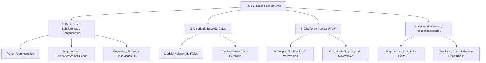

# Fase 2: Diseño del Sistema (Diseño Técnico y Arquitectura)

**Institución:** Universidad Francisco Gavidia (UFG)  
**Facultad:** Facultad de Ingeniería y Sistemas  
**Ciclo:** 02-2026  
**Asignatura:** Aplicación de Técnicas de Ingeniería de Software  
**Grupo:** 01  
**Aula:** A 23-24  
**Horario:** Martes y Jueves 08:10 am – 09:50 am  
**Docente:** Ing. Silvia Janeth Rico de Serrano  
**Contacto Docente:** sserrano@ufg.edu.sv  
**Tipo de Evaluación:** Actividad Evaluada — Fase 2  

---

## 🎯 Objetivo de la Fase

Transformar el **modelo conceptual de análisis** (*el qué*) en una **especificación técnica de arquitectura, componentes y diseño visual completa** (*el cómo*), sirviendo como la **hoja de ruta obligatoria antes de iniciar la codificación**.

---

## 📋 Contenido del Documento Entregable por Equipo

El documento entregable debe estructurarse obligatoriamente en cuatro (4) secciones fundamentales:

---

### 1. Partición del Modelo en Subsistemas y Componentes

Esta sección define la estructura de alto nivel del sistema y cómo interactúan sus bloques de construcción.

* **1.1 Arquitectura del Sistema:**
  * Definición formal del patrón arquitectónico adoptado (ej. Arquitectura en Capas, MVC, Microservicios, Cliente-Servidor, Arquitectura Orientada a Eventos).
  * Justificación técnica de la elección en función de los requerimientos no funcionales (rendimiento, escalabilidad, mantenibilidad, latencia en tiempo real).

* **1.2 Descomposición en Módulos / Subsistemas:**
  * Diagrama formal de componentes UML que organice el sistema en capas bien delimitadas:
    1. **Capa de Presentación:** Clientes web/móvil, interfaces de usuario y componentes visuales.
    2. **Capa de Lógica de Negocio:** Servicios de dominio, orquestadores de procesos, motores de reglas/IA.
    3. **Capa de Acceso a Datos / Persistencia:** Repositorios, clientes ORM/ODM, integraciones con bases de datos y almacenamiento de objetos.
  * Definición de interfaces de comunicación entre capas (protocolos REST, WebSockets, Webhooks, gRPC).

* **1.3 Mecanismos de Control y Recursos Globales:**
  * **Seguridad:** Estrategia de autenticación y autorización (ej. JWT, sesiones seguras, OAuth 2.0, RBAC / control de acceso basado en roles).
  * **Manejo Global de Errores:** Esquema transversal de captura, logging, códigos de estado HTTP estandarizados y respuestas de error uniformes para el cliente.
  * **Gestión de Conexiones a Base de Datos:** Estrategia de pool de conexiones, manejo de variables de entorno, ciclo de vida de conexión y políticas de reintento.

---

### 2. Diseño de la Base de Datos (Estrategia de Administración de Datos)

Esta sección traduce las entidades del negocio en estructuras de persistencia física normalizadas y documentadas.

* **2.1 Modelo Relacional (MR) / Esquema Físico:**
  * Transformación formal del Diagrama Entidad-Relación (DER) conceptual a un modelo de tablas relacionales (SQL) o colecciones/esquemas (NoSQL).
  * Identificación gráfica de relaciones (1:1, 1:N, N:M con tablas intermedias), llaves foráneas y cardinalidades exactas.

* **2.2 Diccionario de Datos Técnico:**
  * Detalle exhaustivo de cada entidad/tabla del sistema que incluya:
    * **Nombre de campos / columnas:** Nomenclatura técnica estándar (ej. snake_case o camelCase consistente).
    * **Tipo de dato físico:** Especificación precisa (ej. `VARCHAR(255)`, `INT`, `BIGINT`, `BOOLEAN`, `TIMESTAMP WITH TIME ZONE`, `UUID`, `JSONB`).
    * **Claves Primarias (PK) y Claves Foráneas (FK):** Indicación explícita de llaves primarias y referencias de llaves foráneas con sus restricciones de integridad referencial (`ON DELETE CASCADE`, `ON UPDATE RESTRICT`, etc.).
    * **Restricciones de nulidad:** Campos obligatorios (`NOT NULL`) y valores predeterminados (`DEFAULT`).
    * **Índices clave:** Índices primarios, índices únicos (`UNIQUE`) e índices de búsqueda/rendimiento para claves foráneas o campos de consulta frecuente.

---

### 3. Diseño de la Interfaz de Usuario (UI/UX)

Esta sección materializa la experiencia del usuario y define los lineamientos visuales y de interacción.

* **3.1 Prototipos de Alta Fidelidad / Wireframes:**
  * Bocetos o prototipos navegables de **todas** las pantallas del sistema:
    * Pantallas de acceso y bienvenida (login, registro, recuperación de cuenta).
    * Tableros principales (*dashboards* con métricas, accesos rápidos y estados).
    * Formularios de captura de datos (configuración, agendamiento, inputs de parámetros).
    * Módulos de consulta y visualización de reportes (resultados, historial, detalle analítico, reproducción multimedia si aplica).
  * Representación de estados de interfaz: carga (*loading skeleton*), estado vacío (*empty state*) y manejo visual de errores.

* **3.2 Guía de Estilo y Navegación:**
  * **Mapa de Sitio / Flujo de Navegación:** Diagrama de transición de estados o diagrama de flujo de usuario (*user flow*) que represente el camino entre pantallas.
  * **Sistema de Diseño Base:**
    * **Paleta de Colores:** Colores primarios, secundarios, neutros, estados de alerta (éxito, advertencia, peligro) con sus respectivos códigos HEX/HSL.
    * **Tipografía:** Familias tipográficas seleccionadas, escala de tamaños (h1 a body/caption) y pesos.
    * **Iconografía y Componentes UI:** Librería de componentes base (botones, modales, tarjetas, inputs).

---

### 4. Mapeo de Clases y Responsabilidades Técnicas

Esta sección establece el puente directo entre el diseño arquitectónico y el código fuente a implementar.

* **4.1 Diagrama de Clases de Diseño (DCD):**
  * Evolución del diagrama conceptual al nivel técnico de implementación:
    * **Visibilidad de atributos y métodos:** Notación UML (`+` public, `-` private, `#` protected).
    * **Tipos de datos explícitos:** Tipado fuerte en atributos y variables.
    * **Firma de métodos:** Nombre del método, parámetros con tipo de dato de entrada y tipo de dato de retorno.
    * **Relaciones entre clases:** Dependencia, agregación, composición, herencia e implementación de interfaces.

* **4.2 Definición de Servicios, Controladores y Repositorios:**
  * Especificación técnica y catálogo de responsabilidades de los componentes de software:
    * **Controladores / APIs (Controllers / Endpoints):** Métodos HTTP (`GET`, `POST`, `PUT`, `DELETE`), rutas, contratos de payload de entrada (*Request DTO*) y contratos de respuesta (*Response DTO*).
    * **Servicios de Negocio (Services):** Lógica pura de dominio, reglas de validación, orquestación de llamadas y casos de uso.
    * **Repositorios de Datos (Repositories / DAOs):** Métodos de persistencia y consultas especializadas a la base de datos.

---

## 🚦 Criterios de Aceptación para la Aprobación de la Fase de Diseño

Para dar por aprobada la Fase 2, cada equipo debe verificar rigurosamente los siguientes tres (3) criterios:

| N° | Criterio | Descripción Exigida |
|:--:|:---|:---|
| **1** | **Consistencia** | Cada elemento diseñado en esta fase debe responder y ser trazable a un requerimiento o caso de uso identificado previamente en la **Fase 1**. No deben existir componentes huérfanos ni requerimientos sin diseño técnico. |
| **2** | **Claridad Técnica** | Nivel de detalle y precisión suficiente para que un **desarrollador externo** pueda construir el software en su totalidad basándose únicamente en estas especificaciones de diseño, sin requerir explicaciones verbales adicionales. |
| **3** | **Formato y Rigor Académico** | Presentación estructurada bajo **Norma APA 7**. Todos los diagramas deben ser legibles, estar debidamente numerados, contar con título formal y notas explicativas correspondientes al pie de cada figura. |

---

## ✅ Matriz de Verificación y Checklist de Entregables

| Sección | Elemento Específico Requerido | Estado | Observaciones / Trazabilidad |
|:---|:---|:---:|:---|
| **1. Subsistemas** | Patrón arquitectónico definido y justificado | `[ ]` | Ej. Cliente-Servidor / Capas / Hexagonal |
| **1. Subsistemas** | Diagrama de componentes por capas (Presentación, Lógica, Datos) | `[ ]` | Notación UML estándar |
| **1. Subsistemas** | Mecanismo de autenticación / autorización (seguridad) | `[ ]` | JWT / OAuth2 / RBAC |
| **1. Subsistemas** | Manejo de errores global y logging | `[ ]` | Middleware / Interceptores globales |
| **1. Subsistemas** | Gestión de conexiones a base de datos | `[ ]` | Connection Pool / ORM |
| **2. Base de Datos** | Modelo Relacional / Físico completo con relaciones | `[ ]` | Cardinalidades, PK y FK explícitas |
| **2. Base de Datos** | Diccionario de datos: nombres, tipos, PK, FK, NOT NULL | `[ ]` | Cobertura al 100% de tablas |
| **2. Base de Datos** | Índices primarios, únicos y de rendimiento definidos | `[ ]` | Optimización de queries |
| **3. UI / UX** | Prototipos navegables / wireframes de alta fidelidad | `[ ]` | Todas las pantallas del sistema |
| **3. UI / UX** | Mapa de navegación / Flujo entre pantallas (Site Map) | `[ ]` | Caminos de usuario |
| **3. UI / UX** | Guía de estilo: paleta de colores (HEX) y tipografías | `[ ]` | Sistema visual consistente |
| **4. Clases** | Diagrama de Clases de Diseño (DCD) con visibilidad y tipos | `[ ]` | UML formal con firmas completas |
| **4. Clases** | Catálogo de Controladores / Endpoints (Rutas, DTOs) | `[ ]` | Contratos de API |
| **4. Clases** | Especificación de Servicios de Negocio | `[ ]` | Casos de uso de negocio |
| **4. Clases** | Especificación de Repositorios / Acceso a datos | `[ ]` | Persistencia y consultas |
| **Criterios** | Trazabilidad con requerimientos de Fase 1 (Consistencia) | `[ ]` | Mapeo 1:1 requerimiento-diseño |
| **Criterios** | Autosuficiencia para desarrollador externo (Claridad Técnica) | `[ ]` | Sin ambigüedades |
| **Criterios** | Cumplimiento de Norma APA 7 en diagramas y formato | `[ ]` | Numeración, títulos y notas |

---

## 📌 Contexto de Aplicación para el Proyecto: Nervio

> [!NOTE]
> Para el sistema **Nervio** (Simulador de Entrevistas Laborales con IA, Voz y Automatización), los requerimientos de esta Fase 2 se alinean con los documentos de arquitectura existentes (`project-flow.md` y `project-overview.md`):

1. **Partición de Subsistemas:**
   * **Frontend:** Next.js (React) + Web Audio API + Better Auth (UI / captura y reproducción de audio).
   * **Backend:** Node.js / NestJS (Tiempo real, WebSockets, orquestación de voz con ElevenLabs, motor conversacional con OpenAI, Session Manager y Modo Estrés).
   * **Automatización:** N8N (Flujos asíncronos: generación previa de preguntas, evaluación profunda de respuestas, generación de feedback hablado, agendamiento y recordatorios vía Resend/Twilio).
2. **Base de Datos (Supabase / PostgreSQL):**
   * Tablas requeridas: `users`, `sessions`, `questions`, `responses`, `evaluations`, `recordings`, `schedules`.
3. **UI/UX:**
   * Pantallas clave: Login/Registro, Configuración de Entrevista (Rol, Nivel, Stack, Modo Estrés), Sala de Entrevista Interactiva (Esfera virtual / onda de audio reactiva), Tablero de Resultados/Reporte y Reproductor de Sesión (Audio Timeline).
4. **Mapeo de Clases y Servicios:**
   * Controladores: `InterviewController` (`/interview/start`, `/interview/message`, `/interview/end`), `ScheduleController` (`/schedule`), `ReportController`.
   * Servicios: `InterviewEngineService`, `VoiceEngineService`, `AIEngineService`, `SessionManagerService`.
