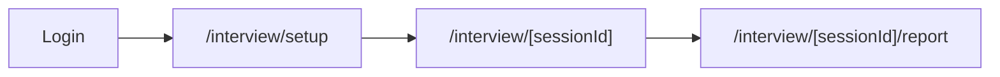

# Flujo de entrevista simulada — Nervio Frontend

Documento de referencia para integrar backend, N8N y audio real sobre la maquetación actual.

## Resumen del flujo UI



| Ruta | Archivo | Descripción |
|------|---------|-------------|
| `/interview/setup` | `src/app/interview/setup/page.tsx` | Formulario de configuración |
| `/interview/[sessionId]` | `src/app/interview/[sessionId]/page.tsx` | Entrevista en vivo (orbe + controles) |
| `/interview/[sessionId]/report` | `src/app/interview/[sessionId]/report/page.tsx` | Reporte final simulado |

Todas las rutas requieren sesión (`requireAuth` en `src/lib/auth-server.ts`).

## Contrato `InterviewService`

Punto único de intercambio mock → API real:

```typescript
// src/lib/interview/interview-service.ts
interface InterviewService {
  start(input: InterviewSetupInput): Promise<{ sessionId: string }>;
  sendMessage(
    sessionId: string,
    payload: { text?: string; audioBlob?: Blob },
  ): Promise<InterviewTurn>;
  end(sessionId: string): Promise<InterviewReport>;
  getReport(sessionId: string): Promise<InterviewReport>;
  getOpeningQuestion(sessionId: string): Promise<string>;
}
```

### Implementación actual

- **API (default):** `src/lib/interview/api-service.ts` → `POST /api/interview/start`
- **Mock (fallback):** `NEXT_PUBLIC_USE_MOCK_INTERVIEW=true` → `mockInterviewService`
- **Factory:** `getInterviewService()` en `src/lib/interview/service-factory.ts`
- **Estado cliente:** `sessionStorage` vía `session-storage.ts`

### Integración N8N Flujo 1 (implementado)

| Paso | Archivo |
|------|---------|
| Adaptador payload | `src/lib/interview/n8n.ts` → `toN8nGenerateInterviewPayload()` |
| Webhook N8N | `callN8nGenerateInterview()` |
| Sync Prisma | `src/lib/interview/sync-session.ts` |
| ElevenLabs TTS | `src/lib/interview/elevenlabs.ts` |
| Route handler | `src/app/api/interview/start/route.ts` |

Variables de entorno: ver `frontend/.env.example`

| Método | Endpoint | Estado |
|--------|----------|--------|
| `start()` | `POST /api/interview/start` | Implementado (N8N + ElevenLabs) |
| `sendMessage()` | `POST /interview/message` | Pendiente (mock local) |
| `end()` | `POST /interview/end` | Pendiente (mock local) |
| `getReport()` | N8N `/final-report` | Pendiente |

Ver también: `frontend/docs/N8N-TABLE-ALIGNMENT.md`

## Mapeo formulario → N8N → Prisma

| Campo UI | TS | N8N body | Prisma |
|----------|-----|----------|--------|
| Puesto | `role` | `role` | `role` |
| Nombre | `candidateName` | en `extra_context` | — |
| Experiencia | `level` | `level` | `level` |
| Tipo entrevista | `interviewType` | `interview_type` | `interviewType` |
| Stack | `stack` | `stack` | `stack` |
| Perfil/contexto | `extraContext` | `extra_context` | `extraContext` |
| — | — | `stress_mode` | `stressMode` (= `agresivo`) |
| — | — | `user_id` | `userId` (auth) |

Validación: `src/lib/validations/interview.ts`

## Estados del orbe

Componente: `src/components/interview/interview-orb.tsx`

| `OrbState` | Cuándo usarlo | CSS |
|------------|---------------|-----|
| `idle` | Conectando, esperando | `orb-state-idle` |
| `speaking` | IA reproduce pregunta/audio | `orb-state-speaking` + ripple |
| `listening` | Usuario habla | `orb-state-listening` |
| `thinking` | Procesando respuesta | `orb-state-thinking` |

Mapeo fase → orbe en `useInterviewSession` (`interview-live-client.tsx`).

**Integración audio:** al recibir evento de ElevenLabs (inicio/fin playback), actualizar `orbState`. Al detectar voz del usuario (MediaRecorder / VAD), pasar a `listening`.

Keyframes en `src/app/globals.css`: `orb-idle`, `orb-speak`, `orb-listen`, `orb-think`, `orb-ripple`.

## Componentes clave

```
src/components/interview/
  interview-setup-form.tsx    # Formulario setup
  interview-live-client.tsx   # Hook + orquestación simulada
  interview-live-shell.tsx    # Layout fullscreen llamada
  interview-orb.tsx           # Orbe animado
  interview-bubble.tsx        # Burbuja con pregunta
  interview-controls.tsx      # Mic, enviar, finalizar
  interview-timeline.tsx      # Historial reciente
  interview-report-client.tsx # Reporte final
```

## Puntos de integración (TODO)

1. **Audio capture** — `interview-controls.tsx`  
   Integrar `MediaRecorder`, enviar `audioBlob` en `sendMessage()`.

2. **Playback TTS** — tras respuesta del backend, reproducir audio y sincronizar `orbState: speaking`.

3. **WebSocket** — opcional para tiempo real; el hook `useInterviewSession` puede suscribirse a eventos en lugar del flujo secuencial mock.

4. **N8N** — `start()` y `end()` deben llamar webhooks según `project-flow.md`:
   - `/generate-interview` al iniciar
   - `/final-report` al finalizar

5. **Persistencia** — reemplazar `sessionStorage` por respuestas del backend + Prisma.

## Cómo probar el flujo simulado

1. `pnpm dev` en `frontend/`
2. Registrarse o iniciar sesión
3. Ir a `/interview/setup`
4. Completar formulario → redirige a `/interview/[uuid]`
5. Esperar conexión (~1.5s) → primera pregunta
6. Pulsar **Enviar respuesta** (texto opcional) varias veces
7. Al terminar preguntas mock → reporte en `/interview/[uuid]/report`

## Decisiones flexibles (por diseño)

- **sessionStorage:** evita backend en demo; fácil de quitar al integrar API.
- **Respuestas placeholder:** si el usuario no escribe, el mock genera texto genérico.
- **Preguntas estáticas por tipo:** en `constants.ts`; N8N las reemplazará.
- **Sin WebRTC/video:** solo orbe visual, alineado con MVP del proyecto.
- **candidateName fuera de Prisma:** se puede añadir al modelo o usar `User.name` al persistir.

## Archivos relacionados del proyecto

- Arquitectura: `/project-flow.md`
- Producto: `/project-overview.md`
- Mockups visuales: `/frontend/stitch-mockups/`
- Schema DB: `/frontend/prisma/schema.prisma`
